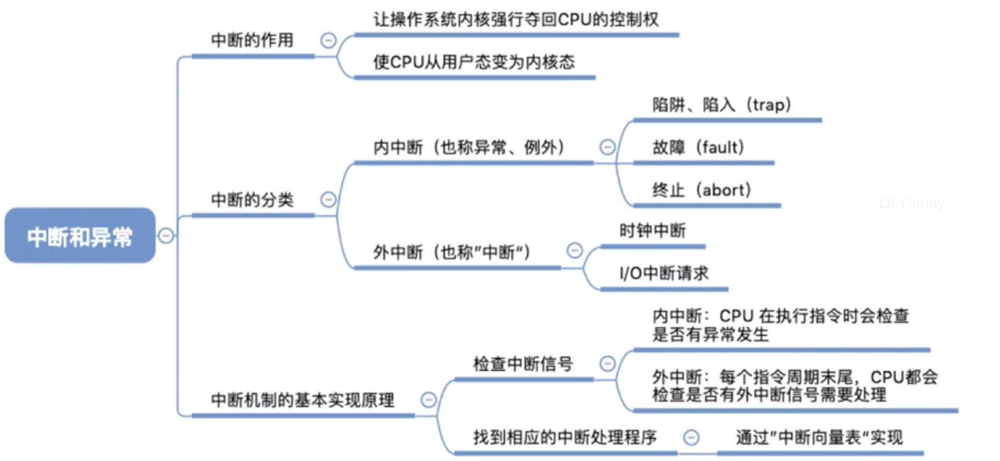

## 中断

中断是让操作系统内核夺回使用权的唯一途径（用户态到核心态）

#### 内中断

中断的产生和现在正在执行的指令有关，中断信号来自于CPU的内部

example：

- 用户态执行特权指令引发中断

- 除数为0，参数错误

- 应用程序执行陷入指令，引发内部中断信号，主动将CPU使用权交还内核，这也就是系统调用。

  陷入指令是非特权指令（用户态）

#### 外中断

中断的产生和现在正在执行的指令**无关**，中断信号来自于CPU的**外部**。

example：

- 时钟中断
- IO中断 比如打印机

#### 总结

#### 中断机制的基本原理

查询中断向量表转向中断处理程序

example：
80x86

| I/O ADDR | INT TYPE（16进制） | FUNCTION                                                     |
| -------- | ------------------ | ------------------------------------------------------------ |
| 00 ~ 03  | 0                  | 除法溢出中断                                                 |
| 04 ~ 07  | 1                  | 单步(用于DEBUG)                                              |
| 08 ~ 0B  | 2                  | 非屏蔽中断(NMI)                                              |
| 0C ~ 0F  | 3                  | [断点](https://baike.baidu.com/item/%E6%96%AD%E7%82%B9)中断(用于DEBUG) |
| 10 ~ 13  | 4                  | 溢出中断                                                     |
| 14 ~ 17  | 5                  | 打印屏幕                                                     |
| 18 ~ 1F  | 6/7                | 保留                                                         |