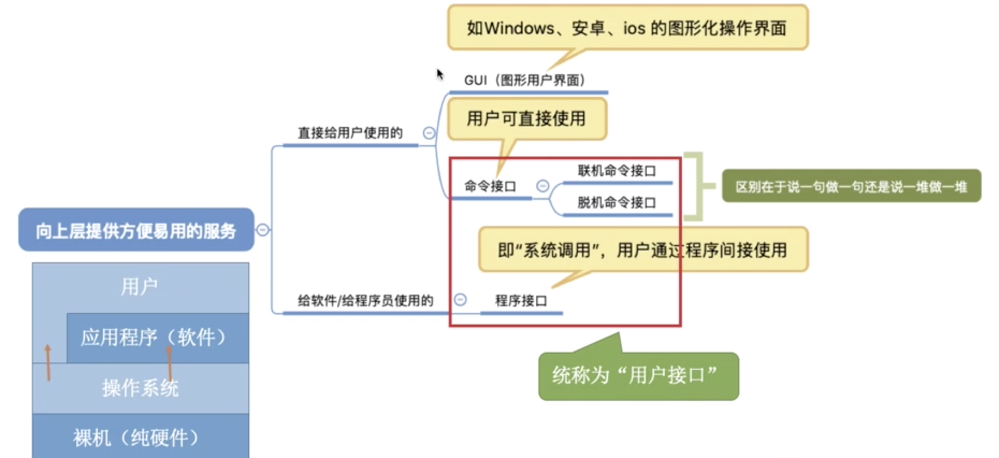
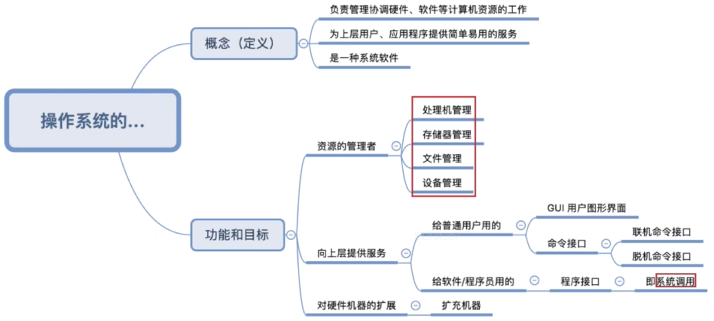
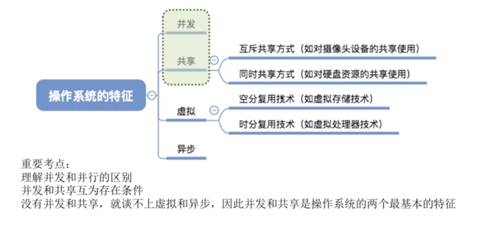

## 操作系统的基本概念

> 操作系统（Operating System）是指控制和管理整个计算机系统的硬件和软件资源，并合理地组织调度计算机的工作和资源的分配：以提供给用户和其他软件方便的接口和环境：它是计算机系统中最基本的系统软件

- 操作系统是系统资源的管理者
- 向上层提供易用的服务

联机命令接口=交互式命令接口

脱机命令接口=批处理命令接口

- 是最接近硬件的一层软件

#### 总结

## 操作系统的特征

- 并发

  并发与并行的区别

  单核CPU同一时刻只能执行一个程序，各个程序只能并发地执行— 轮时间片

  多核CPU同一时刻可以同时执行多个程序，多个程序可以并行的执行

- 共享

​       互斥共享

​       同时共享

- 虚拟

​      空分 虚拟内存

​      时分

- 异步（其实也是并发，没并发哪有异步）

#### 总结

