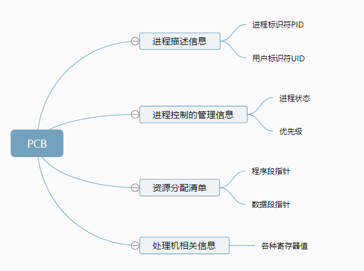
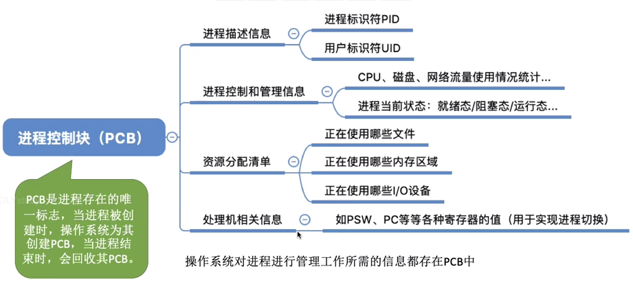
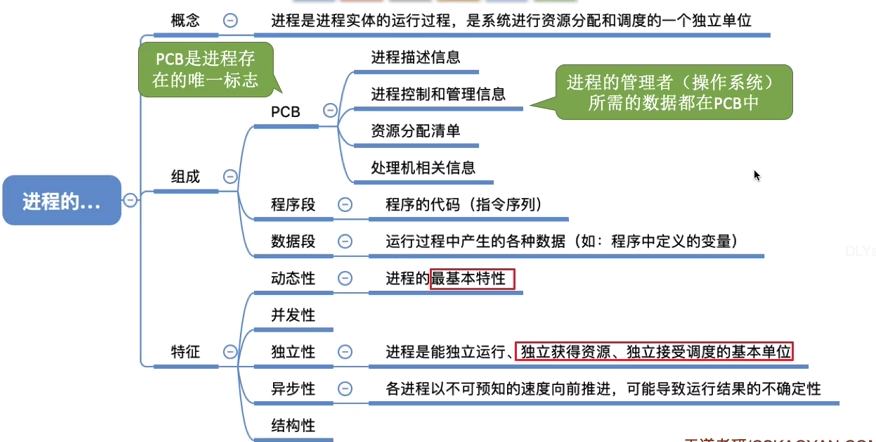

## 进程

> 操作系统进行资源分配和“调度”的**独立单位**

进程是进程实体动态的运行过程，如果非要细分的话

### 进程实体 

 #### **PCB** （进程管理信息）

  系统为每个运行的程序配置一个数据结构，称之为**进程控制块PCB**，用来描述进程的各种信息(如程序代码存放位置)

  其实创建进程就是创建进程实体的PCB，同理撤销

  **PCB是进程存在的唯一标志**

  

      

```
PID
UID
状态
资源分配清单（files 内存  IO设备  程序段指针，数据段指针）
寄存器值（上下文），当进程不在运行时，把cpu的各项寄存器的值，存到进程中
```


#### 程序段 （程序本身运行所需）

程序代码

#### 数据段（程序本身运行所需）

全局变量，局部变量，宏定义的常量


#### 进程的特征

- 动态性 

  进程是程序执行的一次过程，是动态的产生、变化和消亡的，一个qq程序可以运行多次，产生多个进程。

- 并发性 

  内存中有多个进程实体，各进程可并发执行

- 独立性 

  进程是能独立运行、独立获得资源、独立接受调度的基本单位

- 异步性 

  各进程按照各自独立的、不可预知的速度向前推进，操作系统要提供"进程同步机制"来解决异步问题

- 结构性 

  每个进程都有自己的PCB。从结构上看，进程由**程序段、数据段、PCB组成**。

**进程数据块 和 Java虚拟机堆栈？** 

java虚拟机进程也是进程，堆和栈是对它数据部分的具体划分。

#### 总结




