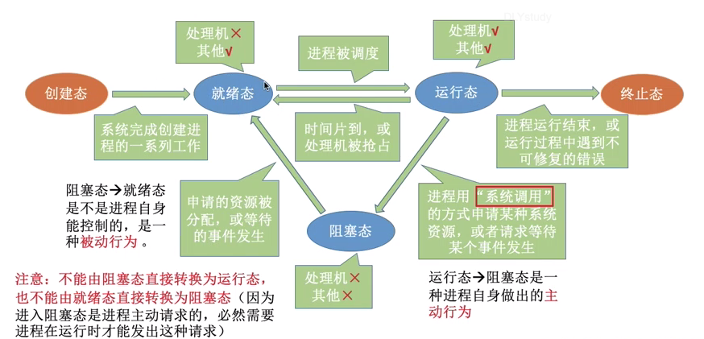
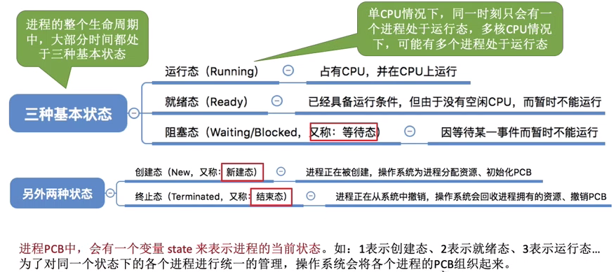
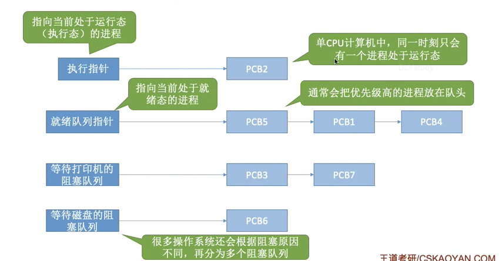
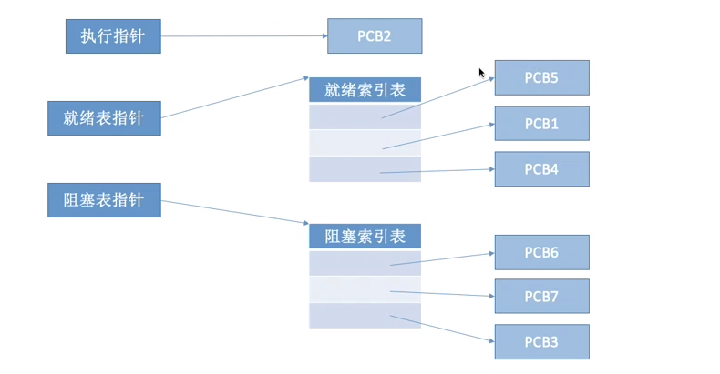
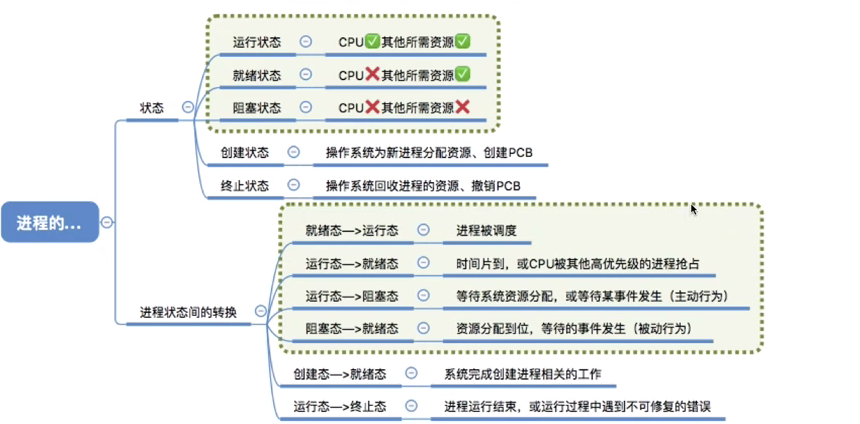

## 进程的状态与切换

进程的状态

在单核情况下，一个时刻只有一个进程处于运行态。双核有两个。

对于就绪态，是万事俱备（资源如打印机）只欠东风（CPU）

### 进程状态

进程的状态的切换(一图即可)!

注意图中的主动和被动

进程不能从阻塞态直接转换为运行态。也不能从就绪态直接转换成阻塞态，没有运行不能发出主动请求。

### 总结

## 进程的组织

> 成百上千个PCB如何组织

链接方式

      按进程状态分队列，操作系统持有不同指针

索引方式

      根据进程状态分索引表，操作系统持有索引表的指针

链接方式

索引方式

### 总结

