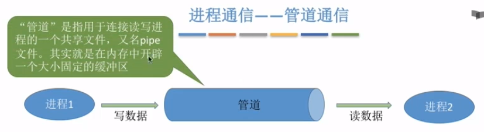
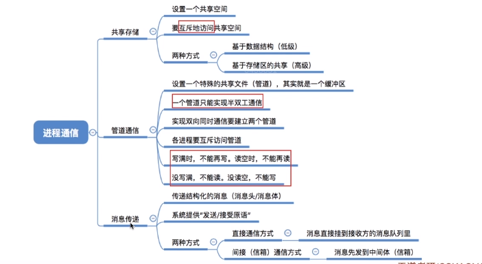

## 进程通信

> 进程信息交换

- 共享存储

- 消息传递

- 管道通信

  

### 共享空间

多个进程互斥的访问共享空间

- 基于存储区的共享，数据的形式和存放位置都由进程控制

### 管道通信

1. 一个管道只能实现半双工(一个方向)的通信，**全双工需要两个管道**

2. 各进程互斥的访问管道

3. 数据以字符流的形式写入管道，当管道写满了，写进程的write()会被阻塞，等待被读取

   反之一样，管道空了,读进程的read()会被阻塞。

4. **写满才能读，读空才能写**

5. 数据一旦被读出，就从管道中被抛弃，这就意味着**读进程最多只能有一个**，否则可能会有读错数据的情况

   

### 消息传递

进程间的数据交换以格式化的消息为单位。进程通过操作系统提供的**发送消息/接受消息两个原语来进行数据交换。

#### 直接通信

把消息直接挂到接收进程的消息缓冲队列上。 

#### 间接通信

消息发送到中间实体（信箱）。

### 总结

