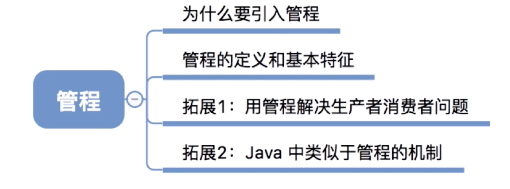
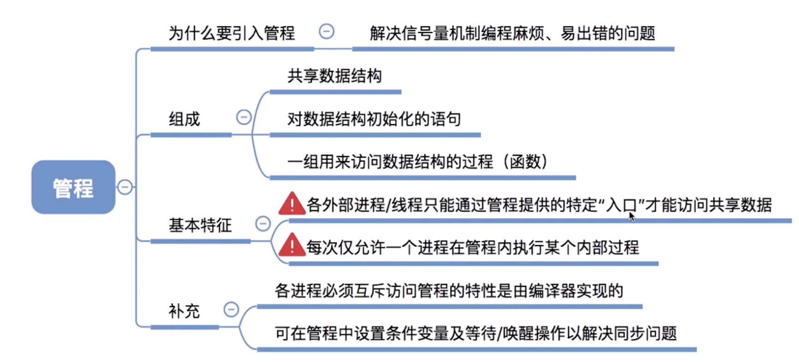

# 管程




## 为什么引入管程

信号量机制存在的问题：编写程序困难、易出错

比如在生产者消费者问题中

```c
producer() {
  while(1){
    生产一个产品；
    P(mutex)  1.
    P(empty)  2.
    把产品放入缓冲区;
    V(mutex);
    V(empty);
  }
  
}
consumer() {
  while(1){
  
    P(mutex)  3.
    P(full)   4.
    从缓冲区一个产品;
    V(mutex);
    V(empty);
    使用产品
  }
  
}
```

像这样如果写错了 P操作的顺序，按①②③ 执行，就会发生死锁

**能不能设计一种机制，让程序员写程序时不需要再关注复杂的 PV 操作，让写代码更轻松呢？**

1973 年，Brinch Hansen 首次在程序设计语言（Pascal) 中引入了“管程”.一种高级同步机制

## 管程的定义和基本特征

**管程和PV操作一样,也是用来实现进程的同步和互斥的**

1. 需要在管程中定义共享数据（如生产者消费者问题的缓冲区）

2. 需要在管程中定义用于访问这些共享数据的“入口“”ーー其实就是一些函数（如生产者消费者

问题中，可以定义一个函数用于将产品放入缓冲区，再定义一个函数用于从缓冲区取出产品）3. 只有通过这些特定的“入口”オ能访问共享数据

4. 管程中有很多“入口”，但是每次只能开放其中ー个“入ロ”，并且只能让一个进程或线程进

入（如生产者消费者问题中，各进程需要互斥地访问共享缓冲区。管程的这种特性即可保证个时间段内最多只会有一个进程在访问缓冲区。注意：**这种互斥特性是由编译器负责实现的，程序员不用关心**）

5.可在管程中设置条件变量及等待/唤醒操作以解决同步问题。可以让一个进程或线程在条件变量

上等待（此时，该进程应先释放管程的使用权，也就是让出“入口”）；可以通过唤醒操作将等待在条件变量上的进程或线程唤醒。


## Java 中类似于管程的机制

Java 中，如果用关键字 synchronized 来描述一个函数，那么这个函数同一时间段内只能被一个线程调用

## 总结




