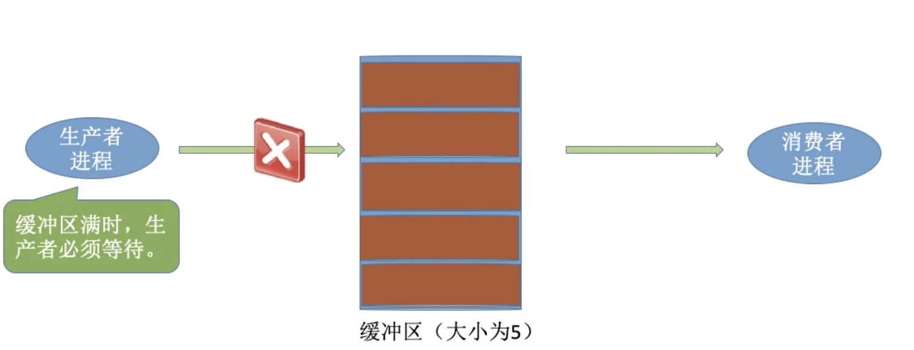
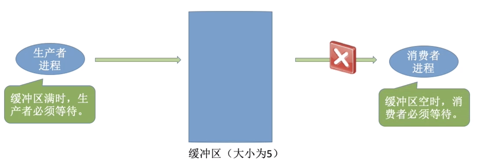
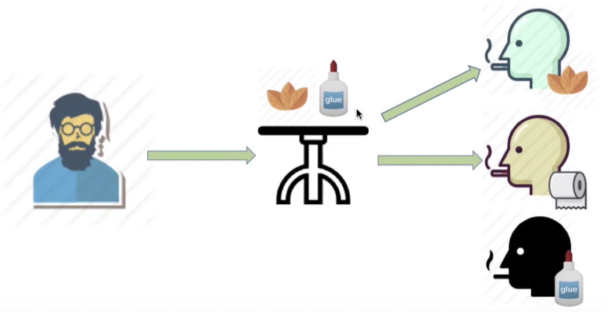
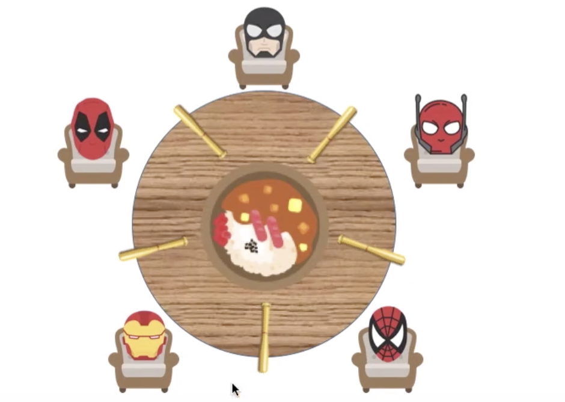

## 生产者消费者问题

系统中有一组生产者进程和一组消费者进程，生产者进程每次生产一个产品放入缓冲区，消费者进程每次从缓冲区中取出一个产品并使用。（注：这里的“产品”理解为某种数据）

生产者、消费者共享一个初始为空、大小为 n 的缓冲区。

只有缓冲区没满时，生产者才能把产品放入缓冲区，否则必须等待。




只有缓冲区不空时，消费者才能从中取出产品，否则必须等待。



>  缓冲区是临界资源，各进程必须互斥地访问。否则可能出现并发问题.
>
> 比如同时两个进程判断没满,都写.或者两个进程判断没空,都去消费

1. 关系分析。找出题目中描述的各个进程，分析它们之间的同步、互斥关系。
2. 整理思路。根据各进程的操作流程确定 P、V 操作的大致顺序。

3. 设置信号量。并根据题目条件确定信号量初值。（互斥信号量初值一般为 1, 同步信号量的初

始值要看对应资源的初始值是多少).


## 多生产者多消费者问题


## 吸烟者问题

> 本质是循环打印abc

### 介绍

假设一个系统有三个抽烟者进程和一个供应者进程。每个抽烟者不停地卷烟并抽掉它，但是要卷起并抽掉一支烟，抽烟者需要有三种材料：烟草、纸和胶水。三个抽烟者中，第一个拥有烟草第二个拥有纸、第三个拥有胶水。供应者进程无限地提供三种材料，供应者每次将两种材料放桌子上，拥有剩下那种材料的抽烟者卷一根烟并抽掉它，并给供应者进程一个信号告诉完成了，供应者就会放另外两种材料再桌上，这个过程一直重复（让三个抽烟者轮流地抽烟）.



本质上这题也属于“生产者一消费者”问题，更详细的说应该是“可生产多种产品的单生产者一多消费者”。

### 分析

1. 关系分析。找出题目中描述的各个进程，分析它们之间的同步、互斥关系。

   桌子可以抽象为容量为1的缓冲区.要互斥访问


​      组合一：纸+胶水

​      组合二：烟草+胶水

​      组合三：烟草+纸

​      同步关系（从事件的角度来分析）：

   - 桌上有组合一,第一个抽烟者取走东西

   - 桌上有组合二,第二个抽烟者取走东西

   - 桌上组合三第三个抽烟者取走东西

     发出完成信号,供应者将下一个组合放到桌上

2. 整理思路。根据各进程的操作流程确定 P、V 操作的大致顺序

   > 互斥前V后P

3. 设置信号量。设置需要的信号量，并根据题目条件确定信号量初值。

   （互斥信号量初值一般为1, 同步信号量的初始值要看对应资源的初始值是多少）

### 实现

```c
semaphore offer1 = 0 //桌上组合一的数量 
semaphore offer2 = 0 //桌上組合二的数量 
semaphore offer3 = 0 //桌上组合三的数量
semaphore finish = 0 //抽烟是否完成
int i =0 //用于实现”三个抽烟者轮流抽烟
```


```c
provider(){
  while(1){
    if(i==0){
    将组合一放桌上；
    V(offer1);
    }else if(i==1){
    将组合二放桌上；
    V(offer2); 
    }else if(i==2){
    将组合三放桌上;
    V(offer3); 
    }
    i = (i+1)%3;
    P(finish);
  }
}	
```


```c
smoker1(){
 while(1){
  P(offer1); 
  //从桌上拿走组合1；卷烟；抽掉；
  V(finish);  
 }
} 

smoker2(){
 while(1){
   P(offer2);
  //从桌上拿走组合2；卷烟；抽掉；
   V(finish);
 }
} 

smoker3(){
 while(1){
   P(offer3)
  //从桌上拿走组合3；卷烟；抽掉；
   V(finish)
 }
} 
```


## 读者 写者问题

### 问题描述

有读者和写者两组并发进程，共享一个文件，当两个或两个以上的读进程同时访问共享数据时不会产生副作用，但若某个写进程和其他进程（读进程或写进程）同时访问共享数据时则可能导致数据不一致的错误。

因此要求：

①允许多个读者可以同时对文件执行读操作

②只允许一个写者往文件中写信息；

③任一写者在完成写操作之前不允许其他读者或写者工作；

④写者执行写操作前，应让已有的读者和写者全部退出。

读 -- 共享S锁

写 -- 互斥X锁

X锁与S锁,其他X锁均互斥

### 分析

1. 关系分析。找出题目中描述的各个进程，分析它们之间的同步、互斥关系。

   两类进程：写进程、读进程

   互斥关系：写进程ー写进程、写进程一读进程。读进程与读进程不存在互斥问题

 

```c
semaphore rw=1; //用于实现对共享文件的互斥访问
```

writer

```c
writer(){
   while(1){
      P(rw); //写之前加锁
      写文件
      V(xw); //写完了解锁
   }
}

```

read

```c
reader(){
   while(1){
      P(rw);//读之前加锁
      读文件
      V(rw);//读完了解锁
   }
}
```

这样已经实现了读写互斥.但是无法让读读不互斥

```c
semaphore rw=1; //用于实现对共享文件的互斥访问
int count=0;    //记录当前有几个读进程在访问文件
```

实现读进程共享

```c
reader(){
   while(1){
     if(count == 0) //由第一个读进程负责
         P(rw);//读之前加锁
     count++;
      读文件
     count--;
     if(count == 0) //由最后个读进程负责
      V(rw);//读完了解锁
   }
}
```

思考：若两个读进程并发执行，则 count=0 时两个进程也许都能满足条件，都会执行 P (rw），从而使第二个读进程阻塞的情况。

如何解决：出现上述问题的原因在于对 count 变量的检查和赋值无法一气呵成，因此可以设置另一个互斥信号量来保证各读进程对 count 的访问是互斥的。


```c
semaphore rw=1; //用于实现对共享文件的互斥访问
int count=0;    //记录当前有几个读进程在访问文件
semaphore mutex=1; //用于保证对 count 变量的互斥访问
```


```c
reader(){
   while(1){
     P(mutex) //各读进程互斥访问 count
     if(count == 0) //由第一个读进程负责
         P(rw);//读之前加锁
     count++;
     V(mutex) //各读进程互斥访问 count
      读文件
     P(mutex) //各读进程互斥访问 count  
     count--;
     if(count == 0) //由最后个读进程负责
      V(rw);//读完了解锁
     V(mutex) //各读进程互斥访问 count
   }
}
```


潜在的问题：只要有读进程还在读,写进程就要一直阻塞等待，可能“饿死”因此，这种算法中，读进程是优先的.

解决写者一直饥饿的问题

```c
semaphore rw=1; //用于实现对共享文件的互斥访问
int count=0;    //记录当前有几个读进程在访问文件
semaphore mutex=1; //用于保证对 count 变量的互斥访问
semaphore w=1; //用于实现写优先
```


```c
writer(){
   while(1){
      P(w);
      P(rw); //写之前加锁
      写文件
      V(xw); //写完了解锁
      V(w);
   }
}
```


```c
reader(){
   while(1){
     P(w);
     P(mutex) //各读进程互斥访问 count
     if(count == 0) //由第一个读进程负责
         P(rw);//读之前加锁
     count++;
     V(mutex) //各读进程互斥访问 count
     V(w);
      读文件
     P(mutex) //各读进程互斥访问 count  
     count--;
     if(count == 0) //由最后个读进程负责
      V(rw);//读完了解锁
     V(mutex) //各读进程互斥访问 count
   }
}
```

结论：在这种算法中，连续进入的多个读者可以同时读文件；写者和其他进程不能同时访问文件；写者不会饥饿，但也并不是真正的“写优先”，而是相对公平的先来先服务原则。

读者-写者问题为我们解決复杂的互回越提供了一个参考思路。

其**核心思想**在于**设置了一个计数器 count** 用来记录当前正在访问共享文件的读进程数。**我们可以用 count的值来判断当前进入的进程是否是第一个/最后一个读进程,从而做出不同的处理。**


> 另外，对 count 变量的检査和赋值不能一气画成导致了一些错误，如果需要实现“一气呵成”，自
>
> 然应该想到用互斥信号量。

最后，还要认真体会我们是如何解决“写进程饥饿”问题的。


## 哲学家进餐问题

> 如何避免死锁

### 介绍

一张圆桌上坐着 5 名哲学家，每两个哲学家之间的桌上摆一根筷子，桌子的中间是一碗米饭。哲学家们倾注毕生的精力用于思考和进餐，哲学家在思考时，并不影响他人。只有当哲学家饥饿时，才试图拿起左、右两根筷子（一根一根地拿起）。如果筷子已在他人手上，则需等待。饥饿的哲学家只有同时拿起两根筷子才可以开始进餐，当进餐完毕后，放下筷子继续思考。




1. 关系分析。系统中有 5 个哲学家进程，5 位哲学家与左右邻居对其中间筷子的访问是互斥关系。

2. 整理思路。这个问题中只有互斥关系，但与之前遇到的问题不同的是，每个哲学家进程需要同时持有两个临界资源才能开始吃饭。如何避免临界资源分配不当造成的死锁现象，是哲学家问题的精髓。

> 每个人都拿一个,都互相等待就死锁了

3. 信号量设置。定义互斥信号量数组chopstick5]1={1,1,1,1,1 }用于实现对 5 个筷子的互斥访问。并对哲学家按 0~4 编号，哲学家 i 左边的筷子编号为 i，右边的筷子编号为（i+1) %5

死锁模拟:
```c
semaphore chopstick [5] = (1,1,1,1,1); 
Pi () { //i 号哲学家的进程
while (1) t

		P(chopstick[i]) ; //拿左
    P(chopstick[(i+1)%5]); //拿右吃饭。
    思考...
    V(chopstick[i]); //放左
    V(chopstick[(i+1)%5); //放右
    思考...
}
```

如果 5 个哲学家并发地拿起了自己左手边的筷子

每位哲学家循环等待右边的人放下筷子（阻塞）,发生“死锁”

### 如何避免死锁

> 资源独占 不可剥夺 请求与保持 循环等待

破坏循环等待

1.可以对哲学家进程施加一些限制条件，比如最多允许四个哲学家同时进餐。

这样可以保证至少有一个哲学家是可以拿到左右两只筷子的.


破坏请求与保持 

2.要求奇数号哲学家先拿左边的筷子，然后再拿右边的筷子，而偶数号哲学家刚好相反。用这种方法可以保证如果相邻的两个奇偶号哲学家都想吃饭，那么只会有其中一个可以拿起第一只筷子，另一个会直接阻塞。**这就避免了占有一支后再等待另一只的情况.**


3.仅当一个哲学家左右两支筷子都可用时才允许他抓起筷子


https://zhuanlan.zhihu.com/p/34553097