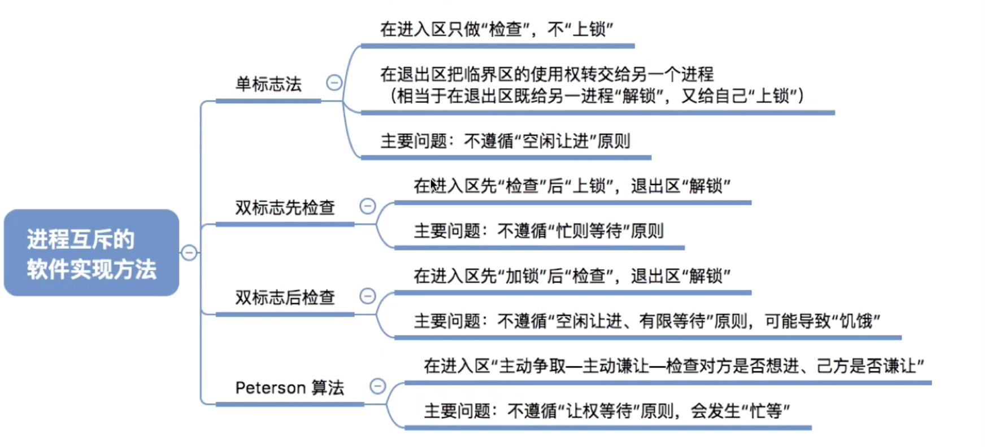
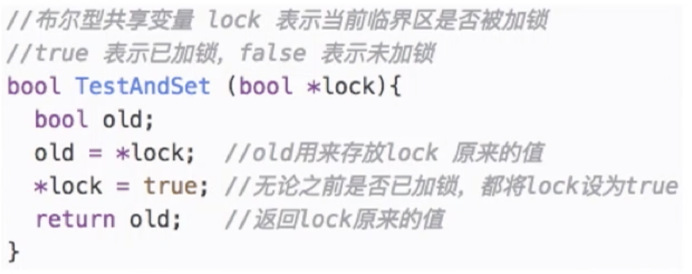

# 进程同步

## 进程同步与互斥

###  什么是进程同步?

进程默认是具有异步性的,各并发执行的进程以各自独立的、不可预知的速度向前推进。

但有些进程的执行是有顺序关系的.比如管道通信


读进程和写进程并发地运行，由于并发必然导致异步性，因此“写数据”和“读数据”两个操作执行的先后顺序是不确定的。而实际应用中，又必须按照“写数据→读数据”的顺序来执行的。

**同步亦称直接制约关系，它是指为完成某种任务而建立的两个或多个进程，这些进程因为需要在某些位置上协调它们的工作次序而产生的制约关系**。

进程间的直接制约关系就是源于它们之间的相互合作。

### 什么是进程互斥

进程的“并发”需要“共享”的支持。各个并发执行的进程不可避免的需要共享一些系统资源(比如内存,又比如打印机、摄像头这样的I/O设备).

**我们把一个时间段内只允许一个进程使用的资源称为临界资源**。许多物理设备（比如摄像头、打印机）都属于临界资源。此外还有许多变量、数据、内存缓冲区等都属于临界资源。

对临界资源的访问，必须互斥地进行。

**互斥，亦称间接制约关系。进程互斥指当一个进程访问某临界资源时，另一个想要访问该临界资源的进程必须等待**。当前访问临界资源的进程访问结東，释放该资源之后，另一个进程才能去访问临界资源。


临界资源的互斥访问,可以在逻辑上分为4个部分.

```
Do {
entry section; //进入区 
Critical section; //临界区 
exit section; //退出区 
remainder section; //剩余区 
}while (true)
```

- 进入区

  负责检查是否可进入临界区，若可进入，则应设置正在访问临界资源的标志（可理解为“上

  锁”），以阻止其他进程同时进入临界区

- 临界区

  访问临界资源的那段代码

- 退出区

  负责解除正在访问临界资源的标志（可理解为“解锁”)

> 临界区是进程中访问临界资源的代码段。
>
> 进入区和退出区是负责实现互斥的代码段。临界区也可称为“临界段”。

为了实现对临界资源的互斥访问，同时保证系统整体性能，需要遵循以下原则

1. 空闲让进。临界区空闲时，可以允许一个请求进入临界区的进程立即进入临界区 
2. 忙则等待。当己有进程进入临界区时，其他试图进入临界区的进程必须等待；
3. 有限等待。对请求访问的进程，应保证能在有限时间内进入临界区（保证不会饥饿）
4. 让权等待。当进程不能进入临界区时，应立即释放处理机，防止进程忙等待。

### 总结


## 进程互斥的实现(课本理论)

### 进程互斥的软件实现


#### 单标志法

算法思想：**两个进程在访问完界区后会把使用临界区的权限转交给另一个进程。也就是说每个进程进入临界区的权限只能被另一个进程赋予**

```c
int turn=0; //turn 表示当前允许进入临界区的进程号
```


turn 的初值为 0, 即刚开始只允许0号进程进入临界区。

若 P1 先上处理机运行，则会一直卡在⑤。直到 P1 的时间片用完，发生调度，切换 P0 上处理机运行。代码①不会卡住 P0, P0 可以正常访问临界区，在 P0 访问临界区期间即时切换回 P1, P1 依然会卡在⑤。

只有 P0在退出区将 turn 改为 1 后，P1 才能进入临界区。

因此，该算法可以实现“同一时刻最多只允许一个进程访问临界区”

缺点

只能按 P0 P1 P0 P1> 这样轮流访问。这种必须“轮流访问”带来的问题是，如果此时允许进入临界区的进程是 P0，而 P0 一直不访问临界区，那么虽然此时临界区空闲，但是并不允许 P1 访问。因此，单标志法存在的主要问题是：违背“空闲让进”原则。 

#### 双标志先检查法

算法思想：

**设置一个布尔型数组 fiag，数组中各个元素用来标记各进程想进入临界区的意愿**，比如 flag [0] =ture意味着0号进程 P0现在想要进入临界区。

每个进程在进入临界区之前先检査当前有没有别的进程想进入临界区，如果没有，则把自身对应的标志 flag设为 true，之后开始访问临界区。


缺点:

若按照①⑤②6③⑦..。的顺序执行，P0 和 P1 将会同时访问临界区。因此，双标志先检査法的主要问题是：违反“忙则等待”原则。

原因在于，进入区的“检査”和“上锁”两个处理不是一气呵成的。“检査”后，“上锁”前可能发生进程切换。

#### 双标志后检查法

算法思想：双标志先检查法的改版。前一个算法的问题是先“检査”后“上锁”，但是这两个操作又无法一气呵成，因此导致了两个进程同时进入临界区的问题。因此，人们又想到先“上锁”后“检査”的方法，来避免上述问题。


缺点:

若按照①⑤②6的顺序执行，P0 和 P1 将都无法进入临界区

因此，双标志后检査法虽然解决了“忙则等待”的问题，但是又违背了“空闲让进”和“有限等待”

原则，会因各进程都长期无法访问临界资源而产生“饥饿”现象。


#### Peterson 算法(实际使用)

算法思想：结合双标志法、单标志法的思想。

双标:表示自己想进 单标:检查对方进没进

如果双方都争着想进入临界区，那可以让进程尝试“孔融让梨”（谦让）。做一个有礼貌的进程。

```c
bool flag[2] //表示进入临界区意愿的数组，初始值都是false   表达意愿
int turn = 0: //turn 表示优先让哪个进程进入临界区表达      表达谦让
```


进入区：

1. 主动争取；
2. 主动谦让；
3. 检查对方是否也想使用，且最后一次是不是自己说了“客气话” 

 Peterson算法用软件方法解决了进程互斥问题，**遵循了空闲让进、忙则等待、有限等待三个原则**，但是**依然未遵循让权等待的原则**

#### 总结




### 进程互斥的硬件实现


#### 中断屏蔽方法(实现简单,效率低,不适用多处理机)

利用开/关中断指令实现(与原语的实现思想相同)

即**在某进程开始访问临界区到结東访问为止都不允许被中断，也就不能发生进程切换，因此也不可能发生两个同时访问临界区的情况**

优点：简单、高效

缺点：不适用于多处理机;只适用于操作系统内核进程,不适用于用户进程(因为开/关中断指令只能运行在内核态，这组指令如果能让用户随意使用会很危险）


#### TestAndSet 指令

TSL 指令是用硬件实现的，执行的过程不允许被中断，只能一气呵成。

以下是用 C 语言描述的逻辑




若刚开始 lock 是 false，则 TSL 返回的 old 值为 false, while 循环条件不满足，直接跳过循环，进入临界区。

若刚开始 lock 是 true，则执行 TLS 后 old 返回的值为 true, while 循环条件满足，会一直循环，直到当前访问临界区的进程在退出区进行“解锁”。

相比软件实现方法，TSL 指令把“上锁”和“检査”操作用硬件的方式变成了一气呵成的原子操作。

优点：实现简单，无需像软件实现方法那样严格检查是否会有逻辑漏洞；适用于多处理机环境

缺点：不满足“让权等待”原则，暂时无法进入临界区的进程会占用 CPU 并循环执行 TSL 指令，从而导致“忙等”。

#### SWAP指令

> 有的地方也叫 Exchange 指令，或简称 XCHG 指令。

Swap 指令是用硬件实现的，执行的过程不允许被中断，只能一气呵成。以下是用 C 语言描述的逻辑


逻辑上来看 Swap 和 TSL 并无太大区别，都是先记录下此时临界区是否已经被上锁（记录在 old 变量上），再将上锁标记 Iock 设置为 true，最后检查 old，如果 old 为 false 则说明之前没有别的进程对临界区上锁，则可跳出循环，进入临界区。


优点：实现简单，无需像软件实现方法那样严格检查是否会有逻辑漏洞；适用于多处理机环境

缺点：不满足“让权等待”原则，暂时无法进入临界区的进程会占用 CPU 并循环执行 SWAP 指令，从而导致“忙等”。

### 总结


## 信号量机制

### 介绍


1965 年，荷兰学者 bistra 提出了一种卓有成效的实现进程互斥、同步的方法ー一信号量机制

用户进程可以通过使用操作系统提供的一对原语来对信号量进行操作，从而很方便的实现了进程互斥、进程同步。

> **原语是一种特殊的程序段,其执行只能一气呵成,不可被中断**。**原语是由关中断/开中断指令实现的**。软件解决方案的主要问题是由“进入区的各种操作无法一气呵成”，因此如果能把进入区、退出区的操作都用“原语”实现，使这些操作能“一气呵成”就能避免问题。

信号量机制主要涉及两种原语:

- wait (S）原语

- signal (S）原语，

  可以把原语理解为我们自己写的函数，函数名分别为 wait 和 signal，括号里的信号量 s 其实就是函数调用时传入的一个参数。

`wait`、`signal`原语常简称为` P、V 操作`（来自荷兰语 proberen 和 verhogen）。因此，做题的时候常把 wait (S）、signal (S）两个操作分别写为 P (S）、V (S).


### 信号量机制一一整型信号量

用一个整数型的变量作为信号量，用来表示系统中某种资源的数量。

> 与普通整数变量的区别：对信号量的操作只有三种，即初始化、P 操作、V 操作

eg：某计算机系统中有一台打印机。


```c
进程PO: 
...
wait(S) //进入区，申请资源 
使用打印机资源 //临界区,访问资源 
signal (S) //返出区，释放资源
...
```

> java中的信号量,初始化许可的数量.acquire-1 release+1

**存在的问题：不满足“让权等待原则，会发生“忙等”**

### 信号量机制一一记录型信号量

整型信号量的缺陷是存在“忙等”问题，因此人们又提出了“记录型信号量”，即用记录型数据结构表示的信号量。

```c
/*记录型信号量的定义*/ 
typedef struct { 
int value //A 剩余资源数 
struct process *L; //等待队列 
}semaphore
```

wait

```c
/*某进程需要使用资源时,通过wait原语申请*/
void wait(semaphore S){
   S.value--;
   if(S value < 0){//小于0说明暂时没有可用的,需要等待
     block(S.L);
   }
}
```

> 如果剩余资源数不够,使用block 原语使进程从运行态进入阻塞态，并把挂到信号量 S 的等待队列（即阻塞队列)中

signal

```c
/*进程使用完资源后，通过signal原语释放*/
void signal(semaphore S){
   S.value++;
   if(S value <= 0){//说明有欠的账
     wakeup(S.L);
   }
}
```

> 释放资源后，若还有别的进程在等待这种资源，则使用 wakeup 原语唤醒等待队列中的
>
> 个进程，该进程从阻塞态变为就绪态
>

**总结**

 wait (S)、signal (S）也可以记为 P (S)、V (S），这对原语可用于实现系统资源的“申请”和“释放”

S.Value 的初值表示系统中某种资源的数目。


对信号量 S的**一次 P 操作意味着进程请求一个单位的该类资源，因此需要执行 S. value--**，表示资源数减 1, 当 S. Value <0 时表示该类资源己分配完毕，因此进程应**调用 block 原语进行自我阻塞**（当前运行的进程**从运行态 →阻塞态**），主动放弃处理机，并插入该类资源的等待队列 S. L 中。可见，该机制**遵循了“让权等待”原则，不会出现“忙等”现象。**


对信号量 **S 的一次∨操作意味着进程释放一个单位的该类资源**，**因此需要执行 S. Value++**，表示资源数加 1, 若加 1 后仍是 S. Value <=0, 表示依然有进程在等待该类资源，因此应**调用 wakeup 原语唤醒等待队列中的第一个进程**（被唤醒进程**从阻塞态就绪态**）。


### 总结


## 信号量实现 同步、互斥、前驱关系

### 介绍


信号量的值=这种资源的剩余数量（信号量的值如果小于 0, 说明此时有进程在等待这种资源）

P (S）一一申请一个资源 S，如果资源不够就**阻塞等待**

V (S) ーー释放一个资源 S，如果有进程在等待该资源，则**唤醒一个进程**

### 信号量机制实现进程互斥

1. 分析并发进程的关键活动，划定临界区（如：对临界资源打印机的访问就应放在临界区）
2. 设置**互斥信号量** mutex,**初值为 1**
3. 在进入区 P (mutex) -- 申请资源 
4. 在退出区 V (mutex) -- 释放资源

```c
/*信号量机制实现互斥*/
semaphore mutex=1; //初始化信号量

P1(){
...
P(mutex) //使用临界资源前要加锁
临界区代码段
V(mutex) //使用临界资源后需要解锁
...
}


P2(){
...
P(mutex) //使用临界资源前要加锁
临界区代码段
V(mutex) //使用临界资源后需要解锁
...
}


```

> 注意：对不同的临界资源需要设置不同的互斥信号量。

P、V 操作必须成对出现。缺少 P (mutex）就不能保证临界资源的互斥访问。缺少 V (mutex）会导致资源永不被释放，等待进程永不被唤醒。

### 信号量机制实现进程同步

进程同步：要让各并发进程按要求有序地推进。

用信号量实现进程同步：

1. 分析什么地方需要实现“同步关系”，即必须保证“**一前一后**”执行的两个操作（或两句代码）

2. 设置同步信号量 S，初始为 0
3. 在“前操作”之后执行 V (S) 
4. 在“后操作”之前执行 P (S)

```c
/*信号量机制实现同步*/
semaphore S=0; //初始化同步信号量，初始值为 0
```


若先执行到 V (S）操作，则 S++后 S=1。之后当执行到 P (S）操作时，由于 S=1, 表示有可用资源，会执行 S-, S 的值变回 0, P2 进程不会执行 block 原语，而是继续往下执行代码 4。

若先执行到 P (S）操作，由于 S=0, S-后 S=1, 表示此时没有可用资源，因此 P 操作中会执行 block 原语，主动请求阻塞。之后当执行完代码 2, 继而执行 V(S）操作，S++，使 S 变回 0, 由于此时有进程在该信号量对应的阻塞队列中，因此会在 V 操作中执行 wakeup 原语，唤醒 P2 进程。这样 P2 就可以继续执行代码 4 了


保证了代码 4 一定是在代码 2 之后执行

> 前 V 后 P 
>
> 信号量 S代表“某种资源”，刚开始是没有这种资源的。P2 需要使用这种资源，而又只能由 P1 产生这种资源


### 信号量机制实现前驱关系

进程 P1 中有句代码 S1, P2 中有句代码 S2, P3 中有句代码 S3.. P6 中有句代码 S6。这些代码要求按如下前驱图所示的顺序来执行：


其实每一对前驱关系都是一个进程同步问题（需要保证一前一后的操作）

1. 要为每一对前驱关系各设置一个同步信号量
2. 在“前操作”之后对相应的同步信号量执行V操作 
3. 在“后操作”之前对相应的同步信号量执行 P 操作


### 总结


