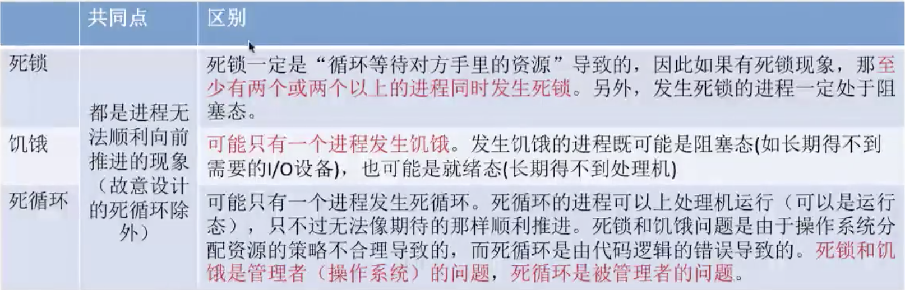

## 死锁概念

### 介绍

死锁：各进程互相等待对方手里的资源，导致各谌程都阻塞，无法向前推进的现象

饥饿：由于长期得不到想要的资源，某进程无法向前推进的现象。比如：在短进程优先（SPF）算法中，若有源源不断的短进程到来，则长进程将一直得不到处理机，从而发生长进程“饥饿”.

死循环：某进程执行过程中一直跳不出某个循环的现象。有时是因为程序逻辑 bug 导致的，有时是程序员故意设计的。

共同点与区别

### 死锁的必要条件

- 资源独占

  只有对必须互斥使用的资源的争抢才会导致死锁(如哲学家的筷子、打印机设备)。像内存、扬声器这样可以同时让多个进程使用的资源是不会导致死锁的（因为进程不用阻塞等待这种资源）。

- 不可剥夺

  进程所获得的資源在未使用完之前，不能由其他进程强行走，只能主动释放。

- 请求与保持

  进程己经保持了至少一个资源，但又提出了新的资源请求，而该资源又被其他进程占有，此时请求进程被阻塞，但又对自己己有的资源保持不放。

- 循环等待

  存在一种进程资源的循环等待链，链中的每一个进程已获得的资源同时被下一个进程所请求。

注意！发生死锁时一定有循环等待，但是发生循环等待时未必死锁（循环等待是死锁的必要不充分条件）有环不一定是走不出来的环.

如果同类资源数大于 1, 则即使有循环等待，也未必发生死锁。但如果系统中每类资源都只有一个，那循环等待就是死锁的充分必要条件了。

### 什么时候会发生死锁

1. 对系统资源的竞争。各进程对不可剥夺的资源（如打印机）的竞争可能引起死锁，对可剥夺的资

源（CPU）的竞争是不会引起死锁的。

2. 进程推进顺序非法。请求和释放资源的顺序不当，也同样会导致死锁。例如，并发执行的进程 P1、P2 分别申请并占有了资源 R1、R2, 之后进程 P1 又紧接着申请资源 R2, 而进程 P2 又申请资源 R1, 两者会因为申请的资源被对方占有而阻塞，从而发生死锁

3. 信号量的使用不当也会造成死锁。如生产者-消费者问题中，如果实现互斥的 P 操作在实现同步的P 操作之前，就有可能导致死锁。（可以把互斥信号量、同步信号量也看做是一种抽象的系统资源）.

### 死锁的处理策略

1. 预防死锁。破坏死锁产生的四个必要条件中的一个或几个。

2. 避免死锁。用某种方法防止系统进入不安全状态，从而避免死锁（银行家算法）

3. 死锁的检测和解除。允许死锁的发生，不过操作系统会负责检测出死锁的发生，然后采取某种措

施解除死锁。

### 总结

## 预防死锁

### 介绍

### 破坏资源独占条件

只有对必须互斥使用的资源的争抢才会导致死锁。

如果把只能互斥使用的资源改造为允许共享使用，则系统不会进入死锁状态。比如：Spooling 技术。操作系统可以采用 Spooling 技术把独占设备在逻辑上改造成共享设备。比如，用 Spooling 技术将打印机改造为共享设备。

使用了 Spooling 技术后，在各进程看来，自己对打印机资源的使用请求立即就被接收处理了，不需要再阻塞等待.

> 利用SPOOLing技术，可将之改造为一台可供多个用户共享的设备，从而提高设备的利用率，也方便了用户。当用户进程请求打印输出时，SPOOLing系统同意为它打印输出，但并不真正立即把打印机分配给该用户进程，而只为它做两件事：
>
> 1）由输出进程在**输出井**中为之申请一个**空闲磁盘块区**，并将要打印的数据送入其中。
>
> 2）输出进程再为**用户进程**申请一张空白的**用户请求打印表**，并将用户的打印要求填入其中，再将该表挂到**请求打印队列上**。如果还有进程要求打印输出，系统仍可接受该请求，也同样为该进程做上述两件事。
>
> -- 如果打印机空闲，输出进程将从**请求打印队列的队首取出一张请求打印表**，**根据表中的要求将要打印的数据从输出井传送到内存缓冲区，再由打印机进行打印**。打印完后，输出进程再查看请求打印队列中是否还有等待打印的请求表。若有，又取出队列中的第一张表，并根据其中的要求进行打印，如此下去，**直至请求打印队列为空，输出进程才将自己阻塞起来**。仅当下次再有打印请求时，输出进程才被唤醒。
>

**并不是所有的资源都可以改造成可共享使用的资源。并且为了系統安全，很多地方还必须保护这种互斥性。因此，很多时候都无法破坏互斥条件。**

### 破坏不可剥夺条件

进程所获得的资源在未使用完之前，不能由其他进程强行夺走，只能主动释放.

#### 方案ー -- 一次性申请：

当某个进程请求新的资源得不到满足时，它必须立即释放保持的所有资源，待以后需要时再重新申请。也就是说，即使某些资源尚未使用完，也需要主动释放，从而破坏了不可剥夺条件。

缺点:

- 反复地申请和释放资源会增加系统开销，降低系统吞吐量。

- 只要暂时得不到某个资源，之前获得的那些资源就都需要放弃，以后再重新申请。如果一直发生这样的情况，就会导致进程饥饿。

#### 方案二 --  剥夺调度：

当某个进程需要的资源被其他进程所占有的时候，可以由操作系统协助，将想要的资源强行剥夺。这种方式一般需要考虑各进程的优先级（比如：剥夺调度方式，就是将处理机资源强行剥夺给优先级更高的进程使用.

该策略的缺点 

- 实现起来比较复杂。
- 释放己获得的资源可能造成前一阶段工作的失效。因此这种方法一般只适用于易保存和恢复状态的资源，如 CPU。

### 破坏请求与保持条件

进程己经保持了至少一个资源，但又提出了新的资源请求，而该资源又被其他进程占有，此时请求进程被阻塞，但又对自己已有的资源保持不放。

#### 静态分配方法

即进程在运行前一次申请完它所需要的全部资源。在它的资源未满足前，不让它投入运行。一旦投入运行后，这些资源就一直归它所有，该进程就不会再请求别的任何资源.

缺点：

- 有些资源可能只需要用很短的时间，因此如果进程的整个运行期间都一直保持着所有资源，就会造成严重的资源浪费，资源利用率极低。

- 另外，该策略也有可能导致某些进程饥饿。

### 破坏循环等待条件

存在一种进程资源的循环等待链，链中的每一个进程已获得的资源同时被下一个进程所请求。

#### 顺序资源分配法

首先给系统中的资源编号，规定每个进程必须按编号递增的顺序请求资源，同类资源（即编号相同的资源）一次申请完。

原理分析：一个进程只有已占有小编号的资源时，才有资格申请更大编号的资源。按此规则，已持有大编号资源的进程不可能逆向地回来申请小编号的资源，从而就不会产生循环等侍的现象。

假设系统中共有 10 个资源，编号为 1,2,...10

在任何一个时刻，总有一个进程拥有的资源编号是最大的，那这个进程申请之后的资源必然畅通无阻。因此，不可能出现所有进程都阻塞的死锁现象.

该策略的缺点：

1. 不方便增加新的设备，因为可能需要重新分配所有的编号 
2. 进程实际使用资源的顺序可能和编号递增顺序不一致，会导致资源浪费
3. 必须按规定次序申请资源，用户编程麻烦。

### 总结

## 死锁避免

### 安全序列、安全状态、死锁

所谓安全序列，就是指如果系统按照这种序列分配资源，则每个进程都能顺利完成。只要能找出一个安全序列，系统就是安全状态。当然，安全序列可能有多个。

如果分配了资源之后，**系统中找不出任何一个安全序列，系统就进入了不安全状态**。这就意味着之后可能所有进程都无法顺利的执行下去。

**当然，如果有进程提前归还了一些资源，那系统也有可能重新回到安全状态**，不过我们在分配资源之前总是要考虑到最坏的情况。

**如果系统处于安全状态，就一定不会发生死锁。如果系统进入不安全状态，就可能发生死锁**（处于不安全状态未必就是发生了死锁，但发生死锁时一定是在不安全状态）

**因此可以在资源分配之前预先判断这次分配是否会导致系统进入不安全状态，以此决定是否答应资源分配请求。这也是“银行家算法”的核心思想。**

### 银行家算法

### 介绍

银行家算法是荷兰学者 Dijkstra 为银行系统设计的，以确保银行在发放现金贷款时，不会发生不能

满足所有客户需要的情况。后来该算法被用在操作系统中，用于避免死锁。

核心思想：在进程提出资源申请时，先预判此次分配是否会导致系统进入不安全状态。如果会进入不安全状态，就暂时不答应这次请求，让该进程先阻塞等待。

资源总数(10,5,7),剩余可用资源(3,3,2)

尝试找出一个安全序列

依次检查剩余可用资源（3,3,2) 是否能满足各进程的需求

- P0进程资源暂时无法满足

- P1进程需求(1,2,2)<(3,3,2) 可满足

  说明如果优先把资源分配给 P1, 那 P1 一定是可以顺利执行结東的。等 P1 结束了就会归还资源。于是，资源数就可以增加到 (2,0,0) + (3,3,2) = (5,3,2)

  **可满足 P1 需求，将 P1 加入安全序列，并更新剩余可用资源值为（5,3,2)**

  

  资源总数（10,5,7），剩余可用资源（5,3,2)

-   重新对比,依旧无法满足P0

-   无法满足P2

-   可满足P3

  说明如果优先把资源分配给 P3, 那 P3 一定是可以顺利执行结東的等 P3 结束了就会归还资源。于是资源数就可以增加到（2,1,1) + (5,3,2) = (7,4,3)

  可满足 P3 需求，将 P3 加入安全序列，并更新剩余可用资源值为（7,4,3)
  
  
  
  资源总数（10,5,7），剩余可用资源（7,4,3)
  
- 重新对比

以此类推，共五次循环检查即可将 5 个进程都加入安全序列中，最终可得一个安全序列。该算法称为安全性算法。可以很方便地用代码实现以上流程，每一轮检査都从编号较小的进程开始检査。实际做题时可以更快速的得到安全序列.

> 经对比发现，(3,3,2) 可满足 P1、P3, 说明无论如何，这两个进程的资源需求一定是可以依次被满足的，因此 P1、P3 一定可以顺利的执行完，并归还资源。可把 P1、P3 先加入安全序列。2,0,0) + (2,1,1) + (3,3,2) = (7,4,3)
>
> 剩下的 P0、P2、P4 都可被满足。同理，这些进程都可以加入安全序列。
>
> 于是，5 个进程全部加入安全序列，说明此时系统处于安全状态，暂不可能发生死锁。

资源总数（10,5, 7），剩余可用资源（3,3,2)

经对比发现，(3,3,2) 可满足 P1、P3, 说明无论如何，这两个进程的资源需求一定是可以依次被满足的，因此 P1、P3 一定可以顺利的执行完，并归还资源。可把 P1、P3 先加入安全序列。（2,0,0) + (2,1,1) + (3,3,2) = (7,4,3)

剩下的 P0 需要（8,4,3), P2 需要（6,5,0), P4 需要（4,3,4) 任何一个进程都不能被完全满足

于是，无法找到任何一个安全序列，说明此时系统处于不安全状态，有可能发生死锁。

### 实现

数据结构：

长度为`m`的一维数组` Available`表示还有多少可用资源 

`n*m `矩阵` Max `表示各进程对资源的最大需求数 

`n*m` 矩阵` Allocation` 表示已经给各进程分配了多少资源 

`Max- Allocation=Need `矩阵表示各进程最多还需要多少资源用

长度为 `m `的一位数组` Request` 表示进程此次申请的各种资源数

银行家算法步骤：

①检査此次申请是否超过了之前声明的最大需求数

②检査此时系统剩余的可用资源是否还能满足这次请求 

③试探着分配，更改各数据结构

④用安全性算法检査此次分配是否会导致系统进入不安全状态.

安全性算法步骤：

检査当前的剩余可用资源是否能满足某个进程的最大需求，如果可以，就把该进程加入安全序列，并把该进程持有的资源全部回收。

不断重复上述过程，看最终是否能让所有进程都加入安全序列

> 系统处于不安全状态未必死锁，但死锁时一定处于不安全状态。系统处于安全状态一定不会死锁。

## 死锁检测与解除

如果系统中既不采取预防死锁的措施，也不采取避免死锁的措施，系统就很可能发生死锁。在这种情况下，系统应当提供两个算法：

**①死锁检测算法：用于检测系统状态，以确定系统中是否发生了死锁。**

**②死锁解除算法：当认定系统中已经发生了死锁，利用该算法可将奈统从死锁状态中解脱出来。**

### 死锁的检测

为了能对系统是否已发生了死锁进行检测，必须:

①用某种数据结构来保存资源的请求和分配信息；

②提供一种算法，利用上述信息来检测系统是否已进入死锁状态。

**资源分配图**:

如果系统中剩余的可用资源数足够满足进程的需求，那么这个进程暂时是不会阻塞的，可以顺利地执行下去。如果这个进程执行结東了把资源归还系统，就可能使某些正在等待资源的进程被激活，并顺利地执行下去。相应的，这些被激活的进程执行完了之后又会归还一些资源，这样可能又会激活另外一些阻塞的进程。

这其实也就是从一个不阻塞的节点开始,消除边的过程.

如果**最终能消除所有边**，就称这个图是**可完全简化的**。**此时一定没有发生死锁（相当于能找到一个安全序列）**.

**如果最终不能消除所有边，那么此时就是发生了死锁。**

**最终还连着边的那些进程就是处于死锁状态的进程。**

比如

总结:

1) 在资源分配图中，找出既不阻塞又不是孤点的进程 i

即找出一条有向边与它相连，且该有向边对应资源的申请数量小于等于系统中已有空闲资源数量。

消去它所有的请求边和分配边，使之称为孤立的结点.

2) 进程ⅰ所释放的资源，可以唤醒某些因等待这些资源而阻塞的进程，原来的阻塞进程可能变为非阻塞进程。

根据 1) 中的方法进行一系列简化后，若能消去途中所有的边，则称该图是可完全简化的.

**死锁定理：如果某时刻系统的资源分配图是不可完全简化的，那么此时系统死锁**

### 死锁的解除

- 资源剥夺法。

  挂起（暂时放到外存上）某些死锁进程，并抢占它的资源，将这些资源分配给

  其他的死锁进程。但是应防止被挂起的进程长时间得不到资源而饥饿。

- 撤销进程法（或称终止进程法）。

  强制撤销部分、甚至全部死锁进程，并剥夺这些进程的资源。

  这种方式的优点是实现简单，但所付出的代价可能会很大。因为有些进程可能已经运行了很长时间，已经接近结束了，一旦被终止可谓功亏一篑，以后还得从头再来。

- 进程回退法。

  让一个或多个死锁进程回退到足以避免死锁的地步。这就要求系统要记录进程的历史信息，设置还原点。

对那些进程动手,主要有以下几个考虑因素

1. 进程优先级 
2. 已执行多长时间 
3. 还要多久能完成
4. 进程已经使用了多少资源

5. 进程是交互式的还是批处理式的

### 总结

