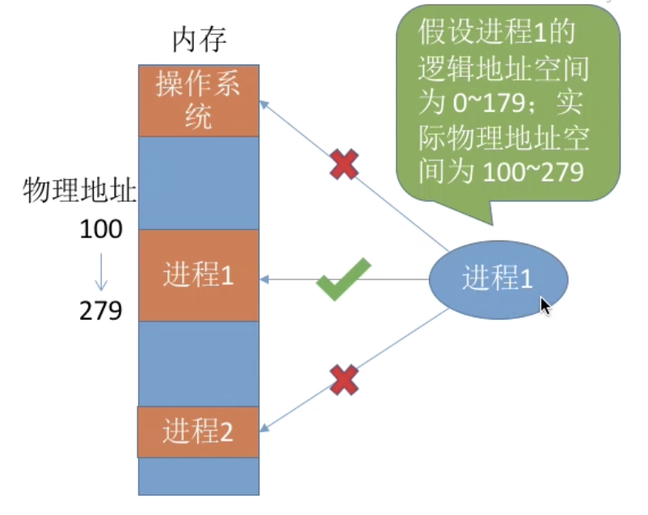
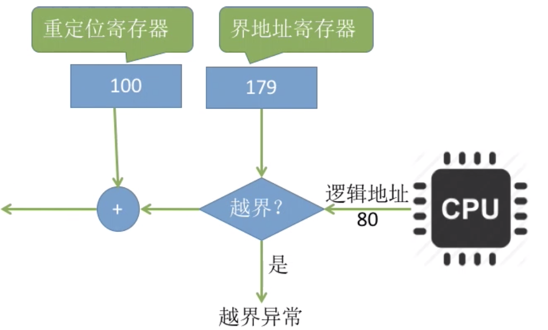
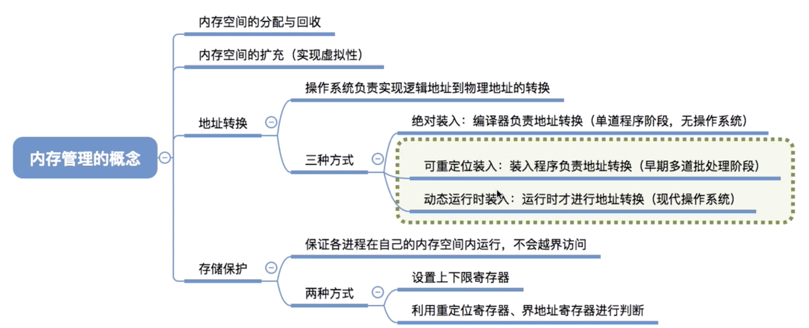

## 内存管理要实现的功能

- 内存空间分配与回收
- 内存空间扩展
- 地址转换
- 内存保护

### 内存空间的分配与回收

操作系统要怎么记录哪些内存区域已经被分配出去了,哪些还空闲.当有新程序进入的时候分配内存空间

当进程运行结東之后，如何回收进程占用的内存空间.

### 内存空间的扩展

游戏 GTA 的大小超过 60 GB，按理来说这个游戏程序运行之前需要把 60 GB 数据全部放入内存。然而，实际我的电脑内存才 4 GB，但为什么这个游戏可以顺利运行呢？

虚拟技术（操作系统的虚拟性）

### 地址转换

为了使编程更方便，程序员写程序时应该只需要关注指令、数据的逻辑地址。

而逻辑地址到物理地址的转换（这个过程称为地址重定位）应该由操作系统负责，这样就保证了程序员写程序时不需要关注物理内存的实际情况。

3种装入方式

### 内存保护

各个进程隔离,互不干扰

#### 方法1 -- 上下限寄存器

在 CPU 中设置一对上、下限寄存器，存放进程的上、下限地址。进程的指令要访问某个地址时，CPU 检查是否越界。

#### 方法2 --  重定位寄存器

使用重定位寄存器（又称基址寄存器）和界地址寄存器（又称限长寄存器）进行越界检査。重定位寄存器中存放的是进程的起始物理地址。**界地址寄存器中存放的是进程的最大逻辑地址**.

## 总结

