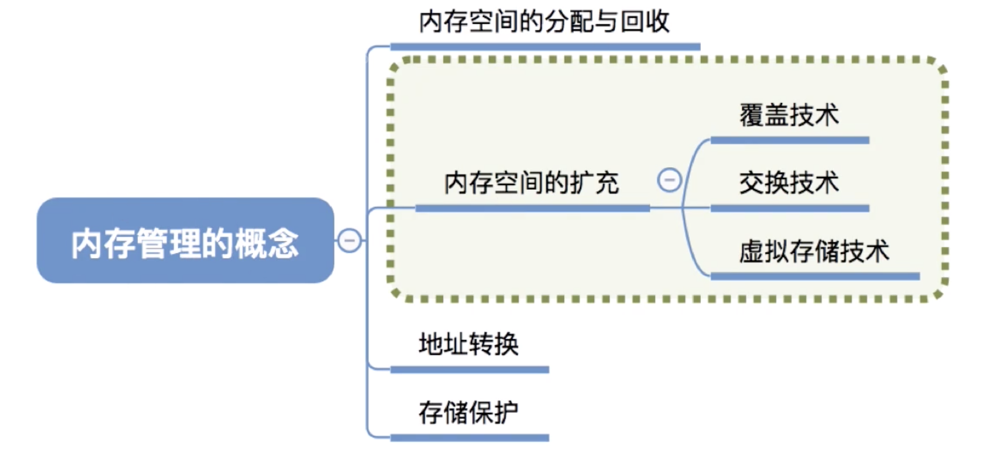
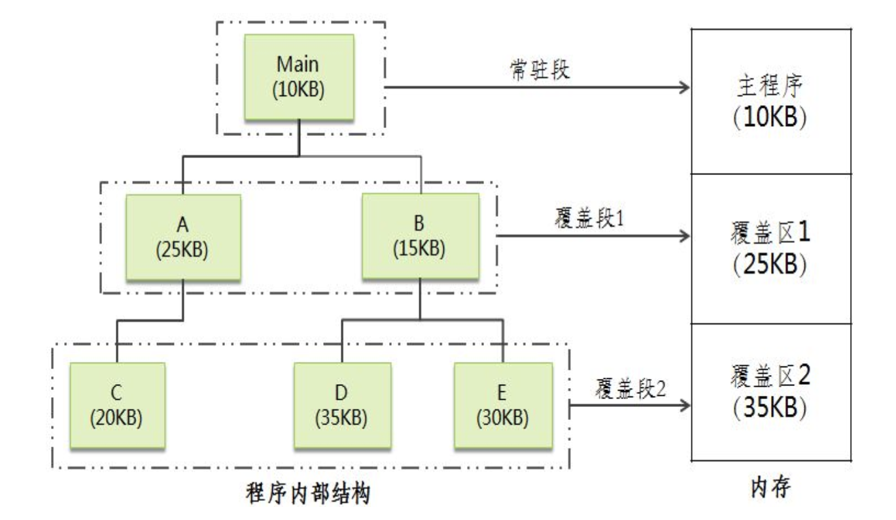
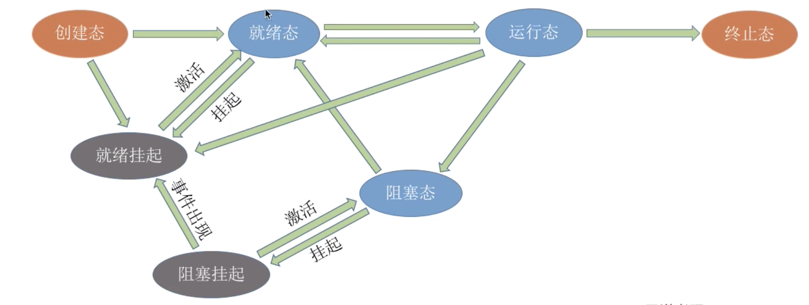
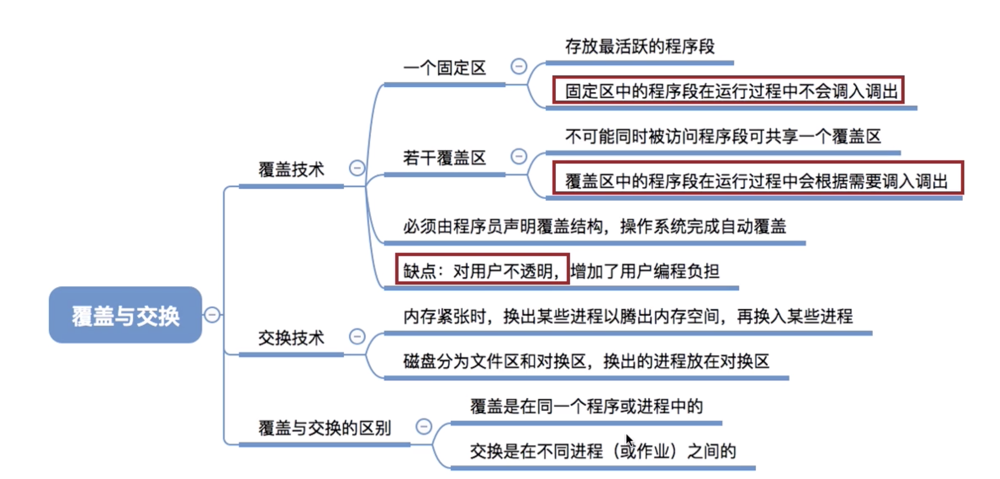

# 覆盖与交换

## 覆盖

### 覆盖技术(早期操作系统)

人们引入了覆盖技术，用来解决“程序大小超过物理内存总和”的问题

覆盖技术的思想：将程序分为多个段（多个模块）。

**常用的段常驻内存，不常用的段在需要时调入内存。**

内存中分为一个“固定区”和若干个“覆盖区”。

需要常驻内存的段放在“固定区”中，调入后就不再调出（除非运行结束）不常用的段放在覆盖区”，需要用到时调入内存，用不到时调出内存.

所谓覆盖，就是把一个大的程序划分为一系列覆盖，每个覆盖就是一个相对独立的程序单位，把程序执行时并不要求同时装入内存的覆盖组成一组，称为覆盖段。**一个覆盖段内的覆盖共享同一存储区域**，该区域成为覆盖区，它与覆盖段一一对应。显然，为了使一个覆盖区能为相应覆盖段中的每个覆盖在不同时刻共享，**其大小应由覆盖段中的最大覆盖来确定**。

**覆盖技术要求程序员必须把一个程序划分为不同的程序段，并规定好它们的执行和覆盖顺序，操作系统根据程序员提供的覆盖结构来完成程序段之间的覆盖。**

### 例子

例如，一个用户程序由6个模块组成，下图给出了各个模块的调用关系，Main模块是一个独立的段，其调用A和B模块，A和B是互斥被调用的两个模块。在A模块执行过程中，调用C模块；而在B模块执行过程中，它可能调用D或E模块（D和E模块也是互斥被调用的）。为该用户程序建立的覆盖结构如下：Main模块是常驻段，其余部分组成两个覆盖段。

由以上推理可知，A和B模块组成覆盖段1，C、D和E组成覆盖段2。为了实现真正覆盖，相应的覆盖区应为每个覆盖段中最大覆盖的大小。覆盖技术的特点是**打破了必须将一个进程的全部信息装入主存后**才能运行的限制，但当同时运行程序的代码量大于主存时仍不能运行。

总结:

**按照自身逻辑结构，让那些不可能同时被访问的程序段共享同个覆盖区**

**必须由程序员声明覆盖结构，操作系统完成自动覆盖。**

**缺点：对用户不透明，增加了用户编程负担**

## 交换

### 交换技术

交换（对换）技术的设计思想：内存空间紧张时，系统将内存中某些进程暂时换出外存，把外存中某些已具备运行条件的进程换入内存（**进程在内存与磁盘间动态调度**）.

> PCB常驻内存,不然没地方记录磁盘中存储进程的位置

中级调度（内存调度），就是要决定将哪个处于挂起状态的进程重新调入内存.

交换（对换）技术的设计思想：内存空间紧张时，系统将内存中某些进程暂时换出外存，把外存中某些已具备运行条件的进程换入内存（进程在内存与磁盘间动态调度）

**暂时换出外存等待的进程状态为挂起状态（挂起态，suspend）**

挂起态又可以进一步细分为就绪挂起、阻塞挂起两种状态

回忆下进程的7状态模型

### 对换的引入

在多道程序环境下，一方面，在内存中的某些进程由于某事件尚未发生而被阻塞运行，但它却占用了大量的内存空间，甚至有时可能出现在内存中所有进程都被阻塞而迫使CPU停止下来等待的情况。另一方面，却又有着许多作业在外存等待，因无内存而不能进入内存运行的情况。显然这是对系统资源的一种严重浪费，使系统吞吐量下降，于是增设了对换（交换）设施。

----- 所谓“对换”，是指把内存中暂时不能运行的进程或者暂时不用的程序和数据调出到外存上，以便腾出足够的内存空间，再把已具备运行条件的进程调入内存。

----- 如果**对换是以整个进程为单位**的，**便称之为“整体对换”或“进程对换”**。解决内存紧张的问题。

----- 如果**对换是以“页”或“段”为单位进行的，则分别称之为“页面对换”或“分段对换”**。为了实现进程对换，系统必须能实现3个方面的功能：对换空间的管理、进程的换出、进程的换入。

2）对换空间的管理

在具有对换功能的OS中，通常把外存分为文件区和对换区。前者用于存放文件，后者用于存放从内存换出的进程。对换区采用的是连续分配的方式（考虑到对换的速度）。

3）进程的换出与换入

换出：每当一进程由于创建子进程而需要更多的内存空间，但又无足够的内存空间等情况发生时，系统应将某进程换出。系统首先选择处于阻塞状态且优先级最低的进程作为换出进程，然后启动磁盘，将该进程的程序和数据传送到磁盘的对换区。若传送过程未出现错误，便可回收该进程所占用的内存空间，并对该进程的进程控制块做相应的修改。

换入：把外存交换区中的数据和程序换到内存中。系统应定时的查看所有进程的状态，从中找出”就绪“状态但已换出的进程。将其中换出时间最久（换出到磁盘上）的进程作为换入进程，将之换入。直至已无可换入的进程或无可换出的进程为止。交换的特点是打破了一个程序一旦进入主存便一直运行到结束的限制，但运行的进程大小仍受实际主存的限制。

与覆盖技术相比，交换不要求程序员给出程序段之间的覆盖结构，而且交换主要是在进程或作业之间进行；而覆盖则主要在同一个作业或进程中进行。另外，覆盖只能覆盖与覆盖程序段无关的程序段。

### 思考

1. 应该在外存（磁盘）的什么位置保存被换出的进程？

2. 什么时候应该交换？

3. 应该换出哪些进程？

#### 应该在外存（磁盘）的什么位置保存被换出的进程？

具有对换功能的操作系统中，通常把磁盘空间分为文件区和对换区两部分。

文件区主要用于存放文件，主要追求存储空间的利用率，因此对文件区空间的管理采用离散分配方式：

对换区空间(Swap)只占磁盘空间的小部分，被换出的进程数据就存放在对换区。由于对换的速度直接影响到系统的整体速度，因此对换区空间的管理主要追求换入换出速度，因此通常对换区采用连续分配方式（学过文件管理章节后即可理解)。总之,对换区的IO速度比文件区的更快。

#### 什么时候应该交换？

交换通常在许多进程运行且内存吃紧时进行，而系统负荷降低就暂停。

例如：在发现许多进程运行时经常发生缺页，就说明内存紧张，此时可以换出一些进程如果缺页率明显下降，就可以暂停换出。

#### 应该换出哪些进程？

可优先换出阻塞进程；可换出优先级低的进程；为了防止优先级低的进程在被调入内存后很快又被换出，有的系统还会考虑进程在内存的驻留时间. 

注意PCB常驻内存,不会被换出.

## 总结

