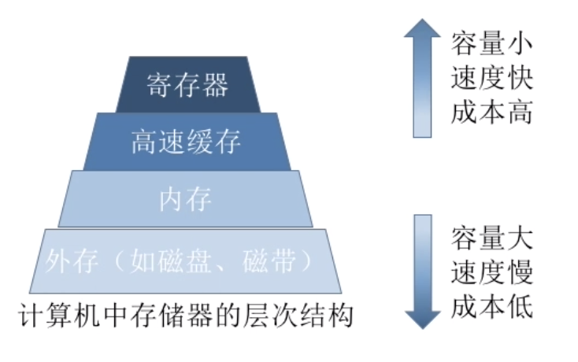
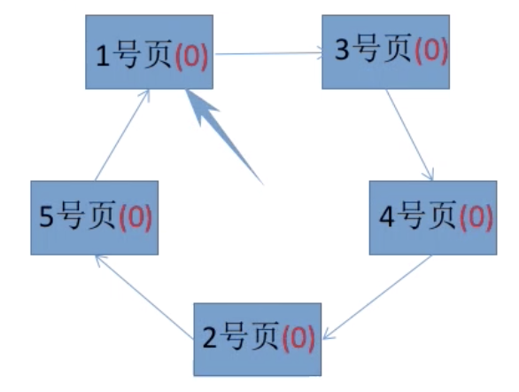

# 虚拟内存技术

## 概述

### 虚拟内存的基本概念

#### 传统存储管理方式的优点和缺点

连续分配:

- 单一连续分配 
- 固定分区分配
- 动态分区分配

非连续分配:

- 基本分页存储管理 

- 基本分段存储管理
- 基本段页式存储管理

**一次性**：作业必须一次性全部装入内存后オ能开始运行。这会造成两个问题：

①作业很大时，不能全部装入内存，导致大作业无法运行；

②当大量作业要求达行时，由于内存无法容纳所有作业，因此只有少量作业能运行，导致多道程序并发度下降。

**驻留性**：一旦作业被装入内存，就会一直驻留在内存中，直至作业运行结東。

事实上，在一个时间段内，只需要访问作业的一小部分数据即可正常运行，这就导致了内存中会驻留大量的、暂时用不到的数据，浪费了宝贵的内存资源。

#### 局部性原理

时间局部性：如果热行了程序中的某条指令，那么不久后这条指令很有可能再次执行；如果某个数据被访问过，不久之后该数据很可能再次被访问。（因为程序中存在大量的循环）

空间局部性：一旦程序访问了某个存储单元，在不久之后，其附近的存储单元也很有可能被访问。（因为很多数据在内存中都是连续存放的，并且程序的指令也是顺序地在内存中存放的）

#### 虚拟内存的定义和特征

基于局部性原理，在程序装入时，可以将程序中很快会用到的部分装入内存，暂时用不到的部分留在外存，就可以让程序开始执行。

在程序执行过程中，当所访问的信息不在内存时，由操作系统负责将所需信息从外存调入内存，然后继续执行程序

若内存空间不够，由操作系统负责将内存中暂时用不到的信息换出到外存

在操作系统的管理下，在用户看来似乎有一个比实际内存大得多的内存，这就是虚拟内存.

这也是操作系统虚拟性的体现

#### 虚拟内存的特性

虚拟内存有一下三个主要特征

- 多次性：无需在作业运行时一次性全部装入内存，而是允许被分成多次调入内存。
- 对换性：在作业运行时无需一直常驻内存，而是允许在作业运行过程中，将作业换入、换出。
- 虚拟性：从逻辑上扩充了内存的容量，使用户看到的内存容量，远大于实际的容量

#### 如何实现虚拟内存技术

虚拟内存技术，允许一个作业分多次调入内存。如果采用连续分配方式，会不方便实现。**因此，虚拟内存的实现需要建立在离散分配的内存管理方式基础上。**

基本分传统的非连续分配存储管理:

- 基本分页
- 基本分段
- 基本段页

虚拟内存的实现:

- 请求分页存储管理

- 请求分段存储管理

- 请求段页式存储管理

主要区别：

在程序执行过程中，当所访问的信息不在内存时，由操作系统负责将所需信息从外存调入内存，然后继续执行程序。

若内存空间不够，由操作系统负责将内存中暂时用不到的信息换出到外存.

这也就是要增加两个功能:

- 请求调页/段
- 页面置换/段置换

#### 总结

## 请求分页的管理方式

### 介绍

请求分页存储管理与基本分页存储管理的主要区别：

在程序执行过程中，当所访问的信息不在内存时，由操作系统负责将所需信息从外存调入内存，然后继续执行程序.

若内存空间不够，由操作系统负责将内存中暂时用不到的信息换出到外存操作系统.

这也就是操作系统要提供的两个功能:

- 操作系统要提供请求调页功能将缺失页面从外存调入内存
- 操作系统要提供页面置换的功能将暂时用不到的页面换出外存

### 页表机制

## 页面置换算法

### 理论上 -- 最佳置换算法（OPT)

最佳置换算法（OPT, Optimal）：每次选择淘汰的页面将是以后永不使用，或者在最长时间内不再被访问的页面，这样可以保证最低的缺页率。

> 注意：缺页时未必发生页面置换。若还有可用的空闲内存块，就不用进行页面置换

最佳置换算法可以保证最低的缺页率，但实际上，只有在进程执行的过程中才能知道接下来会访问到的是哪个页面。操作系统无法提前预判页面访问序列。因此，最佳置换算法是无法实现的

### 先进先出置换算法（FIFO)

每次选择淘汰的页面是最早进入内存的页面

实现方法：把调入内存的页面根据调入的先后顺序排成一个队列，需要换出页面时选择队头页面即可。队列的最大长度取決于系统为进程分配了多少个内存块。

例子:

例：假设系统为某进程分配了三个内存块，并考虑到有以下页面号引用串：

3,2,1,0,3,2,4,3,2,1,0,4

逐渐占用内存页

给进程分配的内存块开始不足,选择从队列尾部内存块移除内容,放入新内容.并移动到队头.

以此类推,再不足则移除队尾2号的内容.

可以看到缺页中断发生了9次.

例：假设系统为某进程分配了**4个**内存块，并考虑到有以下页面号引用串：

3,2,1,0,3,2,4,3,2,1,0,4

可以看到缺页中断发生了10次.

这就是**Belady 异常ーー当为进程分配的物理块数増大时，缺页次数不减反增的异常现象**。(贝拉迪异常)

只有 FIFO 算法会产生 Belady 异常。另外，FIFO 算法虽然实现简单，但是该算法与进程实际运行时的规律不适应，因为先进入的页面也有可能最经常被访问。因此，算法性能差

### 最近最久未使用LRU

每次淘汰的页面是最近最久未使用的页面

实现方法：赋予每个页面对应的页表项中，用**访问字段记录该页面自上次被访问以来所经历的时间 t** .

当需要淘汰一个页面时，选择现有页面中 t 值最大的，即最近最久未使用的页面。

例子:

例：假设系统为某进程分配了四个内存块，并考虑到有以下页面号引用串 1,8,1,7,8,2,7,2,1,8,3,8,2,1,3,1,7,1,3,7

在手动做题时，若需要淘汰页面，可以逆向检查此时在内存中的几个页面号。在逆向扫描过程中最后个出现的页号就是要淘汰的页面。

### LFU(Least Frequently Used)

最近最少频率，每个数据块维护一个访问计数，一定时间内，按照这个计数的大小，选择计数值最小的页面进行淘汰.

### 时钟置换算法（CLOCK)

最佳置换算法性能最好，但无法实现：先进先出置换算法实现简单，但算法性能差；最近最久未使用置换算法性能好，是最接近 OpT 算法性能的，但是实现起来需要专门的硬件支持，算法开销大。

时钟置换算法是一种性能和开销较均衡的算法，又称 CLOCK 算法，或最近未用算法（NRU, Not

Recently Used)

简单的 CLOCK 算法实现方法：

**为每个页面设置一个访问位**，**再将内存中的页面都通过链接指针链接成个循环队列**。

当某页被访问时，其访问位置为 1。

当需要淘汰一个页面时，只需检査页的访问位。如果是 0, 就选择该页换出；

如果是 1, 则将它置为 0, 暂不换出，继续检査下一个页面，若第一轮扫描中所有页面都是 1, 则将这些页面的访问位依次置为 0 后，再进行第二轮扫描（第二轮扫描中一定会有访问位为 0 的页面，因此**简单的 CLOCK 算法选择一个淘汰页面最多会经过两轮扫描**）

例子

例：假设系统为某进程分配了五个内存块，并考虑到有以下页面号引用串 1,3,4,2,5,6,3,4,7

当需要访问6号页面的时候全部都置为0.

进行第二轮扫描时候,发现1号页面范围位置为0.所以把1号页面换出.换入6号页,并置为1.扫描的指针指向下一个页面

### 改进型的时钟置换算法

简单的时钟置换算法仅考虑到一个页面最近是否被访问过。事实上，如果被淘汰的页面没有被修改过，就不需要执行 IO 操作写回外存。只有被淘汰的页面被修改过时，才需要写回外存。

因此，**除了考虑一个页面最近有没有被访问过之外，操作系统还应考虑页面有没有被修改过**。在**其他条件都相同时,应优先淘汰没有修改过的页面,避免I/O操作**。

这就是改进型的时钟置换算法的思想。修改位=0, 表示页面没有被修改过；修改位=1, 表示页面被修改过

为方便讨论，用（访问位，修改位）的形式表示各页面状态。如（1,1) 表示一个页面近期被访问过且被修改过。

算法规则：将所有可能被置换的页面排成一个循环队列

第一轮：从当前位置开始扫描到第一个 (0,0) 的帧用于替换。本轮扫描不修改任何标志位

第二轮：若第一轮扫描失败，则重新扫描，査找第一个（0,1) 的帧用于替换。本轮将所有扫描过的帧访问位设为 0.

第三轮：若第二轮扫描失败，则重新扫描，查找第一个（0,0) 的帧用于替换。本轮扫描不修改任何标志位

第四轮：若第三轮扫描失败，则重新扫描，査找第一个（0,1) 的帧用于替换。

由于第二轮已将所有帧的访问位设为 0, 因此经过第三轮、第四轮扫描定会有一个帧被选中，因此改进型 CLOCK 置换算法选择一个淘汰页面最多会进行四轮扫描.

**第一优先级：最近没访问且没修改的页面**

**第二优先级：最近没访问，但修改过的页面**

**第三优先级：最近访问过，但没修改的页面**

**第四优先级：最近访问过且修改过的页面**

### 总结

## 页面分配策略

### 驻留集

#### 介绍

驻留集：指请求分页存储管理中给进程分配的物理块的集合。

考虑一个极端情况，若某进程共有 100 个页面，则该进程的驻留集大小为 100 时,

进程可以全部放入内存，运行期间不可能再发生缺页。

若驻留集大小为 1, 则进程运行期间必定会极频繁地缺页

若**驻留集太小，会导致缺页频繁**，系统要花大量的时间来处理缺页，实际用于进程推进的时间很少；

**驻留集太大，又会导致多道程序并发度下降，资源利用率降低**。所以应该选择一个合适的驻留集大小。

> 这里的资源利用率降低主要指的是,由于程序并发度下降,IO等资源的空闲时间会增多

### 页面分配 置换策略

固定分配：操作系统为每个进程分配一组固定数目的物理块，在进程运行期间不再改变。即，驻留集大小不变

变分配：先为每个进程分配一定数目的物理块，在进程运行期间，可根据情况做适当的増加或减少。即，驻留集大小可变

局部置换：发生缺页时只能选进程自己的物理块进行置换。

全局置换：可以将操作系统保留的空闲物理块分配给缺页进程，也可以将别的进程持有的物理块置换到外存，再分给缺页进程。

#### 固定分配大小驻留集 -- 局部置换

系统为每个进程分配一定数量的物理块，在整个运行期间都不改变。

若进程在运行中发生缺页，则只能从该进程在内存中的页面中选出一页换出，然后再调入需要的页面。

**这种策略的缺点是：很难在刚开始就确定应为每个进程分配多少个物理块才算合理。（采用这种策略的系统可以根据进程大小、优先级、或是根据程序员给出的参数来确定为一个进程分配的内存块数）**

#### 动态分配大小驻留集 -- 局部置换

刚开始会为每个进程分配定数量的物理块。当某进程发生缺页时，只允许从该进程自己的物理块中选出一个进行换出外存。如果进程在运行中频繁地缺页，系统会为该进程多分配几个物理块，直至该进程缺页率趋势适当程度：反之，如果进程在运行中缺页率特别低，则可适当减少分配给该进程的物理块。

 

#### 动态分配大小驻留集 -- 全局置换

可变分配全局置换刚开始会为每个进程分配一定数量的物理块。

操作系统会保持一个空闲物理块队列。

当某进程发生缺页时，从空闲物理块中取出一块分配给该进程；

若已无空闲物理块，则可选择个未锁定的页面换出外存，再将该物理块分配给缺页的进程。

采用这种策略时，只要某进程发生缺页，都将获得新的物理块，仅当空闲物理块用完时，系统才选择一个未锁定的页面调出。被选择调出的页可能是系统中任何一个进程中的页，因此这个被选中的进程拥有的物理块会减少，缺页率会增加.

> 系统会锁定一些页面，这些页面中的内容不能置换出外存（如：重要的内核数据可以设为“锁定”）

可变分配全局置换：只要缺页就给分配新物理块

可变分配局部置换：要根据发生缺页的频率来动态地增加或减少进程的物理块

### 何时调入页面

#### 进程初始化--预调页策略

根据局部性原理，一次调入若干个相邻的页面可能比一次调入一个页面更高效。

但如果提前调入的页面中大多数都没被访问过，则又是低效的。因此可以预测不久之后可能访问到的页面，将它们预先调入内存，但目前预测成功率只有 50%左右。**故这种策略主要用于进程的首次调入**由程序员指出应该先调入哪些部分。

> 主要指空间局部性，即：如果当前访问了某个内存单元，在之后很有可能会接着访问与其相邻的那些内存单元。

#### 运行时--请求调页策略

**进程在运行期间发现缺页时才将所缺页面调入内存。**

由这种策略调入的页面一定会被访问到,但由于每次只能调入一页,而每次调页都要磁盘I/O操作,因此I/O开销较大。

### 何处调入页面

- 系统拥有足够的对换区空间：

  页面的调入、调出都是在内存与对换区之间进行，这样可以保证页面的调入、调出速度很快。

  在进程运行前需将进程相关的数据从文件区复制到对换区.

- 系统缺少足够的对换区空间：

  凡是不会被修改的数据都直接从文件区调入，由于这些页面不会被修改，因此换出时不必写回磁盘，下次需要时再从文件区调入即可。对于可能被修改的部分，换出时需写回磁盘对换区，下次需要压再从对换区调入

- unix实现方式

  **运行之前进程有关的数据全部放在文件区，故未使用过的页面，都可从文件区调入。**

  **若被使用过的页面需要换出，则写回对换区，下次需要时从对换区调入。**

### 抖动（颠簸）现象

刚刚换出的页面马上又要换入内存，刚刚换入的页面马上又要换出外存，这种频繁的页面调度行为称为抖动，或颠簸。

产生抖动的主要原因是进程频繁访问的页面数目高于可用的物理块数（分配给进程的物理块不够）

> 为进程分配的物理块太少，会使进程发生抖动现象。为进程分配的物理块太多，又会降低系统整体的并发度，降低某些资源的利用率

为了研究为应该为每个进程分配多少个物理块，Denning 提出了进程“工作集”的概念

### 工作集

驻留集：指请求分页存储管理中给进程分配的内存块的集合。

工作集：指在某段时间间隔里，进程实际访问页面的集合。

操作系统会根据“窗口尺寸”来算出工作集。

例：某进程的页面访问序列如下，窗口尺寸为 4, 各时刻的工作集为？

24,15,18,23,24,17,18,24,18,17,17,15

工作集大小可能小于窗口尺寸，实际应用中，操作系统可以统计进程的工作集大小，根据工作集大小给进程分配若干内存块。如：窗口尺寸为 5, 经过一段时间的监测发现某进程的工作集最大为 3, 那么说明该进程有很好的局部性，可以给这个进程分配 3 个以上的内存块即可满足进程的运行需要。

**一般来说，驻留集大小不能小于工作集大小，否则进程运行过程中将频繁缺页。**

> 拓展：基于局部性原理可知，进程在一段时间内访问的页面与不久之后会访问的页面是有相关性的。因此，可以根据进程近期访问的页面集合（工作集）来设计一种页面置换算法ー一选择一个不在工作集中的页面进行淘汏。

### 总结

