## 连续管理分配方式

连续分配：指为用户进程分配的必须是一个连续的内存空间。


### 单一连续分配(过期)

在单一连续分配方式中，内存被分为系统区和用户区系统区通常位于内存的低地址部分，用于存放操作系统相关数据;用户区用于存放用户进程相关数据。

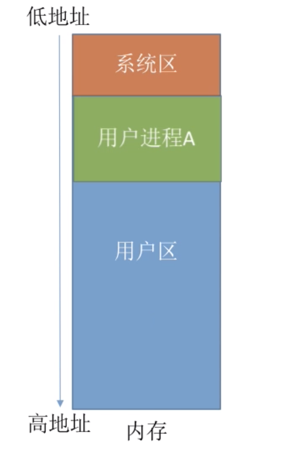

**内存中只能有一道用户程序，用户程序独占整个用户区空间。**

优点：

实现简单无外部碎片；

可以采用覆盖技术扩充内存；

不一定需要采取内存保护（eg：早期的 PC 操作系统 MS-DOS）。

缺点：

只能用于单用户、单任务的操作系统中；有内部碎片(使用不上)；存储器利用率极低。

> 分配给某进程的内存区域中，如果有些部分没有用上，就是“内部碎片”


### 固定分区分配

20 世纪 60 年代出现了支持多道程序的系统，为了能在内存中装入多道程序，且这些程序之间又不会相互干扰，

于是将整个用户空间划分为若干个固定大小的分区，在每个分区中只装入一道作业，这样就形成了最早的、最简单的一种可运行多道程序的内存管理方式。

分区可大小相等,也可大小不等

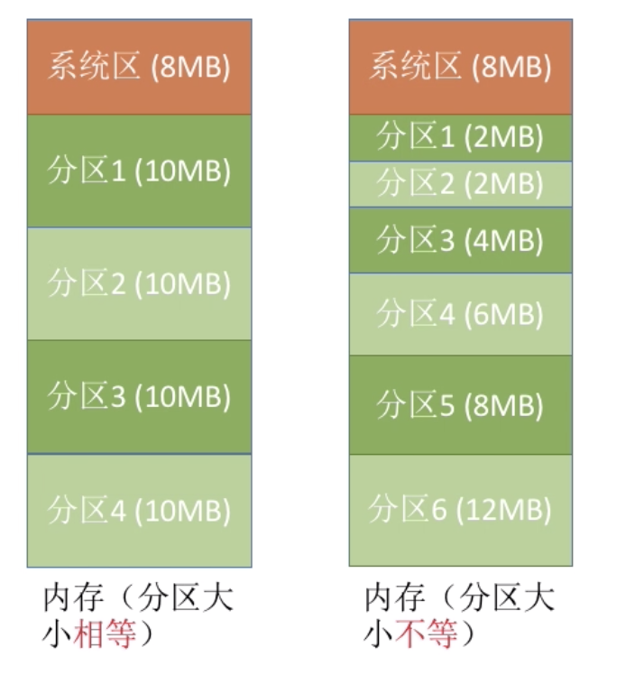


分区大小相等：缺乏灵活性，但是很适合用于用一台计算机控制多个相同对象的场合（比如：钢铁厂有 n 个相同的炼钢炉，就可把内存分为 n 个大小相等的区域存放 n 个炼钢炉控制程序）

分区大小不等：增加了灵活性，可以满足不同大小的进程需求。根据常在系统中运行的作业大小情况进行划分（比如：划分多个小分区、适量中等分区、少量大分区）

#### 分区说明表

操作系统需要建立一个数据结构一一分区说明表，来实现各个分区的分配与回收。每个表项对应一个分区，通常按分区大小排列。每个表项包括对应分区的大小、起始地址、状态（是否己分配）。


用数据结构的数组（或链表）即可表示这个表

当某用户程序要装入内存时，由操作系统内核程序根据用户程序大小检索该表，从中找到一个能满足大小的、未分配的分区，将之分配给该程序，然后修改状态为“已分配”


优点：实现简单，无外部碎片。

缺点：a。当用户程序太大时，可能所有的分区都不能满足需求，此时不得不采用覆盖技术来解决，但这又会降低性能；b。会产生内部碎片，内存利用率低。


### 动态分区分配

#### 介绍

动态分区分配又称为可变分区分配。这种分配方式不会预先划分内存分区，而是在进程装入内存时根据进程的大小动态地建立分区，并使分区的大小正好适合进程的需要。因此系统分区的大小和数目是可变的。（eg：假设某计算机内存大小为 64 MB，系统区 8 MB，用户区共 56 MB.)

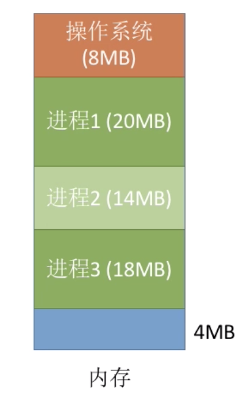

#### 思考

1. 系统要用什么样的数据结构记录内存的使用情况？

2. 当很多个空闲分区都能满足需求时应该选择哪个分区进行分配？

3. 如何进行分区的分配与回收操作？

#### 系统要用什么样的数据结构记录内存的使用情况？

- 空闲分区表
- 空闲分区链

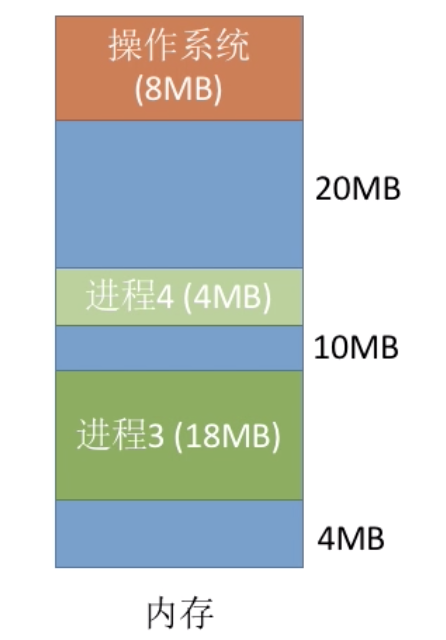

空闲分区表


**空闲分区表：每个空闲分区对应表项。**

表项中包含分区号、分区大小、分区起始地址等信息


空闲分区链


空闲分区链：每个分区的起始部分和末尾部分分别设置前向指针和后向指针。起始部分处还可记录分区大小等信息


#### 当很多个空闲分区都能满足需求时应该选择哪个分区进行分配？

应该用最大的分区进行分配？还是用最小的分区进行分配？又或是用地址最低的部分进行分配？

把一个新作业装入内存时，须按照一定的**动态分区分配算法**，从空闲分区表（或空闲分区链）中选出一个分区分配给该作业。由于分配算法算法对系统性能有很大的影响，因此人们对它进行了广泛的研究


#### 如何进行分区的分配与回收操作？

以空闲分区表为例子

增加/修改/删除表记录


#### 碎片

动态分区分配又称为可变分区分配。这种分配方式不会预先划分内存分区，而是在进程装入内存时根据进程的大小动态地建立分区，并使分区的大小正好适合进程的需要。因此系统分区的大小和数目是可变的。

**动态分区分配没有内部碎片，但是有外部碎片。**

内部碎片，分配给某进程的内存区域中，如果有些部分没有用上外部碎片，是指内存中的某些空闲分区由于太小而难以利用。

如果内存中空闲空间的总和本来可以满足某进程的要求，但由于进程需要的是一整块连续的内存空间，因此这些“碎片”不能满足进程的需求。可以通过紧凑（拼湊，Compaction）技术来解决外部碎片。

这时候就要利用内存调度当temp,当然,动态重定位的装入方式最适合.

### 总结


## 动态空间分配算法

在动态分区分配方式中，当很多个空闲分区都能满足需求时，应该选择哪个分区进行分配？

### 介绍

- 首次适应算法（First Fit）
- 最佳适应算法（Best Fit）
- 最坏适应算法（Worst Fit）
- 邻近适应算法（Next Fit)

### 首次适应

算法思想：每次都从低地址开始査找，找到第一个能满足大小的空闲分区。

如何实现：空闲分区以地址递增的次序排列。每次分配内存时顺序査找空闲分区链(或空闲分区

表),找到大小能满足要求的第一个空闲分区.


### 最佳适应

算法思想：由于动态分区分配是一种连续分配方式，为各进程分配的空间必须是连续的一整片区域。因此为了保证当“大进程”到来时能有连续的大片空间，可以尽可能多地留下大片的空闲区即，优先使用更小的空闲区。

如何实现：**空闲分区按容量递増次序链接**。每次分配内存时顺序査找空闲分区链（或空闲分区表），找到大小能满足要求的第一个空闲分区。

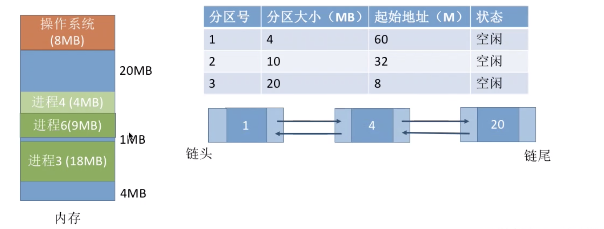

当然,这样处理后一般需要重新调正链表顺序,以保证按容量递增

缺点：**每次都选最小的分区进行分配，会留下越来越多的、很小的、难以利用的内存块。因此这种方法会产生很多的外部碎片**

### 最坏适应

又称最大适应算法（Largest Fit)

算法思想：为了解决最佳适应算法的问题一一即留下太多难以利用的小碎片，可以在每次分配时优先使用最大的连续空闲区，这样分配后剩余的空闲区就不会太小，更方便使用

如何实现：空闲分区按容量递减次序链接。每次分配内存时顺序査找空闲分区链（或空闲分区表），找到大小能满足要求的第一个空闲分区。

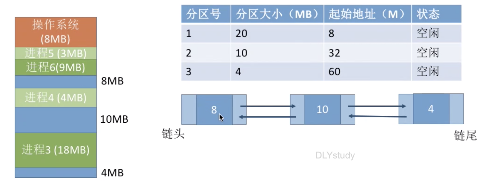


缺点：每次都选最大的分区进行分配，虽然可以让分配后留下的空闲区更大，更可用，

**但是这种方式会导致较大的连续空闲区被迅速用完。如果之后有“大进程”到达，就没有内存分区可用了。**

### 临近适应

算法思想：首次适应算法每次都从链头开始査找的。这可能会导致低地址部分出现很多小的空闲分区，而每次分配査找时，都要经过这些分区，因此也增加了査找的开销。如果每次都从上次査找结束的位置开始检索，就能解决上述问题

如何实现：空闲分区以地址递增的顺序排列（可排成一个循环链表）。每次分配内存时从上次查找结束的位置开始査找空闲分区链（或空闲分区表，找到大小能满足要求的第一个空闲分区。

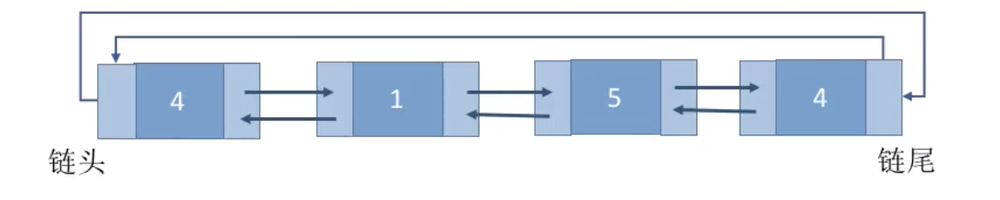

首次适应算法每次都要从头査找，每次都需要检索低地址的小分区但是这种规则也决定了当低地址部分有更小的分区可以满足需求时会更有可能用到低地址部分的小分区，也会更有可能把高地址部分的大分区保留下来（最佳适应算法的优点）

邻近适应算法的规则可能会导致无论低地址、高地址部分的空闲分区都有相同的概率被使用，也就导致了高地址部分的大分区更可能被使用，划分为小分区，最后导致无大分区可用（最大适应算法的缺点）

### 总结

综合来看,首次适应算法的效果反而更好


## 非连续分配管理方式

连续分配：为用户进程分配的必须是一个连续的内存空间

非连续分配：为用户进程分配的可以是一些分散的内存空间。

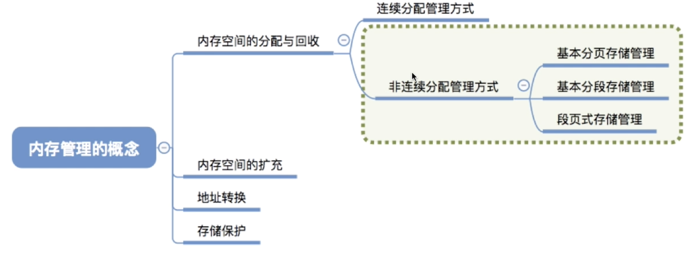

基本分页存储管理 

基本分段存储管理

段页式存储管理


### 基本分页存储管理 

#### 什么是分页存储

将内存空间分为一个个大小相等的分区（比如：每个分区4KB），每个分区就是一个“页框”（页框=页帧=内存块=物理块=物理页面）。每个页框有一个编号，即“页框号”（页框号=页帧号=内存块号=物理块号=物理页号），页框号从 0 开始。

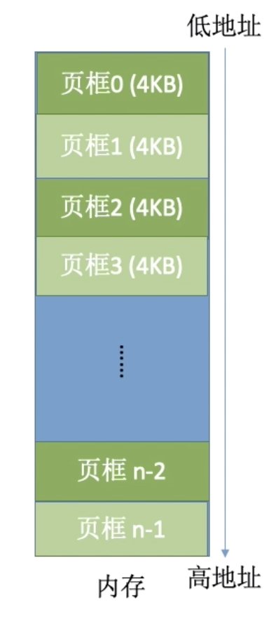

将进程的逻辑地址空间也分为与页框大小相等的一个个部分，每个部分称为一个“页”或“页面”。每个页面也有一个编号，即“页号”，页号也是从 0 开始。

将进程的逻辑地址空间也分为与页框大小相等的一个个部分，每个部分称为一个“页”或“页面”。每个页面也有一个编号，即“页号”，页号也是从 0 开始。

操作系统以页框为单位为各个进程分配内存空间。进程的每个页面分别放入一个页框中。也就是说，进程的页面与内存的页框有一一对应的关系。

**各个页面不必连续存放，可以放到不相邻的各个页框中。**

#### 页表

为了能知道进程的每个页面在内存中存放的位置，操作系统要为每个进程建立一张页表。注：页表通常存在 PCB（进程控制块）中.

1. 一个进程对应一张页表

2. 进程的每个页面对应一个页表项 

3. 每个页表项由“页号”和“块号”组成

4. 页表记录进程页面和实际存放的内存块之间的映射关系

   

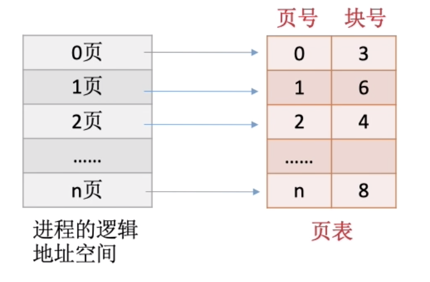

   


#### 思考

1. 每个页表项多大？占几个字节？
2. 如何通过页表实现逻辑地址到物理地址的转换？

####  每个页表项多大？占几个字节？
Eg：假设某系统物理内存大小为 4 GB，页面大小为 4 KB，则每个页表项至少应该为多少字节？
4GB=2^32
4KB=2^12
所以会被分成2^20个内存块

内存块号的范围是0-2^20-1,则内存块号至少需要占用20bit来表示,也就是3B.
(计算机中内存块的数量￫ 表项中块号至少占多少字节)

页表项连续存放，因此页号可以是隐含的，不占存储空间（类比数组的index不需占存储空间）

> 注意：页表记录的只是内存块号，而不是内存块的起始地址！
J号内存块的起始地址=J* 内存块大小

#### 如何通过页表实现逻辑地址到物理地址的转换？

进程在内存中连续存放时，操作系统是如何实现逻辑地址到物理地址的转换的？

寄存器中存的起始地址+偏移量

将进程地址空间分页之后，操作系统该如何实现逻辑地址到物理地址的转换？

如果要访问逻辑地址 A，则

 1.确定逻辑地址 A 对应的“页号”P

 2.找到 P 号页面在内存中的起始地址（需要査页表）

 3.确定逻辑地址 A 的“页内偏移量”w

 4.逻辑地址 A 对应的物理地址=P 号页面在内存中的起始地址+页内偏移量 W

#### 确定逻辑地址所在的页号和偏移量

eg：在某计算机系统中，页面大小是 50 B。某进程逻辑地址空间大小为 200 B，则逻辑地址 110 对应的页号、页内偏移量是多少？

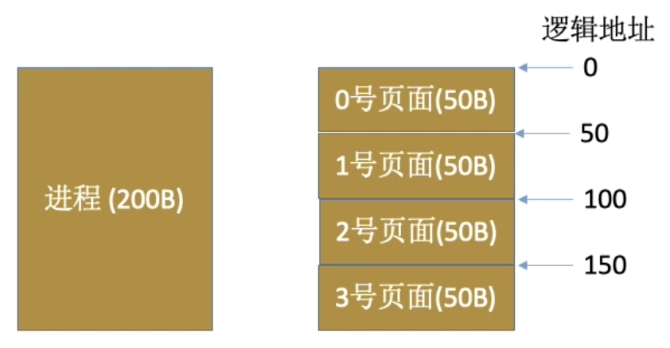

页号=逻辑地址/页面长度(取除法的整数部分) 

页内偏移量=逻辑地址%页面长度（取除法的余数部分）

页号=110/50=2

页内偏移量=110%50=10

逻辑地址可以拆分为（页号，页内偏移量）通过页号查询页表，可知页面在内存中的起始地址

页面在内存中的起始地址+页内偏移量=实际的物理地址

> 在计算机内部，地址是用二进制表示的，如果页面大小刚好是 2 的整数幕，则计算机硬件可以很快速的把逻辑地址拆分成（页号，页内偏移量）
>
> 结论：如果每个页面大小为 2^K B，用二进制数表示逻辑地址，则末尾 K 位即为页内偏移量，其余部分就是页号

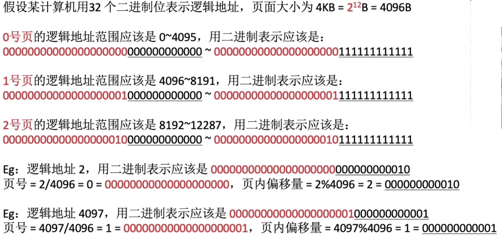

总结：页面大小刚好是 2 的整数幂有什么好处？

①逻辑地址的拆分更加迅速一一如果每个页面大小为 2 B，用二进制数表示逻辑地址，则末尾 K 位即为页内偏移量，其余部分就是页号。因此，如果让每个页面的大小为 2 的整数幂，计算机硬件就可以很方便地得出一个逻辑地址对应的页号和页内偏移量，而无需进行除法运算，从而提升了运行速度。

②物理地址的计算更加迅速一一根据逻辑地址得到页号，根据页号查询页表从而找到页面存放的内

存块号，将二进制表示的内存块号和页内偏移量拼接起来，就可以得到最终的物理地址。

#### 逻辑地址结构

分页存储管理的逻辑地址结构如下所示：


地址结构包含两个部分：前一部分为页号，后一部分为页内偏移量 W。在上图所示的例子中，地址长度为 32 位，其中 0~11 位为“页内偏移量”，或称“页内地址”；12~31 位为“页号”。

如果有 K 位表示“页内偏移量”，则说明该系统中一个页面的大小是 2 ^K个内存单元,如果有 M 位表示“页号”，则说明在该系统中，一个进程最多允许有 2^M个页面.

页面大小 <->. 页内偏移量位数 -> 逻辑地址结构


#### 总结


#### 两级页表


### 基本分段存储管理

#### 介绍


进程的地址空间：按照程序自身的逻辑关系划分为若干个段，每个段都有一个段名（在低级语言中，程序员使用段名来编程），每段从 0 开始编址.

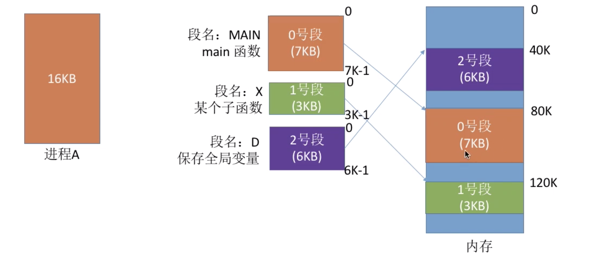

按逻辑功能划分段,程序可读性更高.

#### 分段


分段系统的逻辑地址结构由段号（段名）和段内地址（段内偏移量）所组成。

- 段号的位数决定了每个进程最多可以分几个段

- 段内地址位数决定了每个段的最大长度是多少

eg:

段号的位数决定了每个进程最多可以分几个段

段内地址位数决定了每个段的最大长度是多少

```
LOAD 1, [D] | <A> //将分段D中A单元内的值读入寄存器1 
STORE 1, [X] |<B> //将寄存器1的内容存入X分段的B单元中
```

写程序时使用的段名[D]、[X] 会被编译程序成对应段号

 <A>单元、<B>单元被编译程序翻译翻译成段内地址

如图:

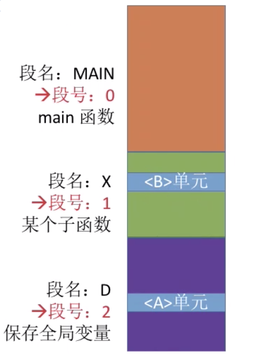

#### 段表

程序分多个段，各段离散地装入内存，为了保证程序能正常运行，就必须能从物理内存中找到各个逻辑段的存放位置。为此，需为每个进程建立一张段映射表，简称“段表”。

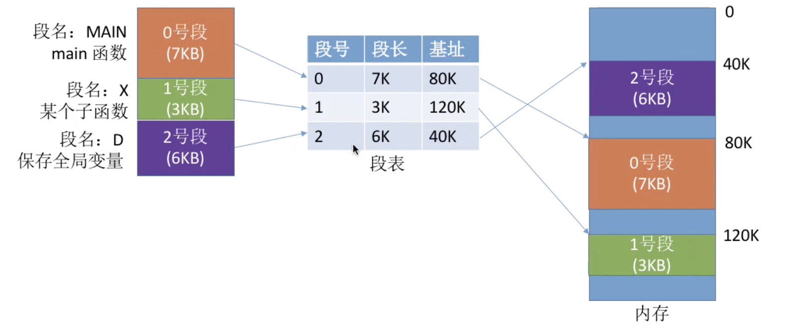

1.每个段对应一个段表项，其中记录了该段在内存中的起始位置（又称“基址”）和段的长度。

2.各个段表项的长度是相同的。

例如：某系统按字节寻址，采用分段存储管理，逻辑地址结构为（段号 16 位，段内地址 16 位），因此用 16 位即可表示最大段长。物理内存大小为 4 GB（可用 32 位表示整个物理内存地址空间）。因此，可以让每个段表项占 16+32=48 位，即 6 B。由于段表项长度相同，因此段号可以是隐含的，不占存储空间。若段表存放的起始地址为 M，则 K 号段对应的段表项存放的地址为 M+K*6


#### 地址变换

```
LOAD 1,[D]|A;//将分段D中A单元内的值读入寄存器1
```

经过编译程序编译后，形成等价的机器指令：

“取出段号为 2, 段内地址为 1024 的内存单元中的内容，放到寄存器 1 中”

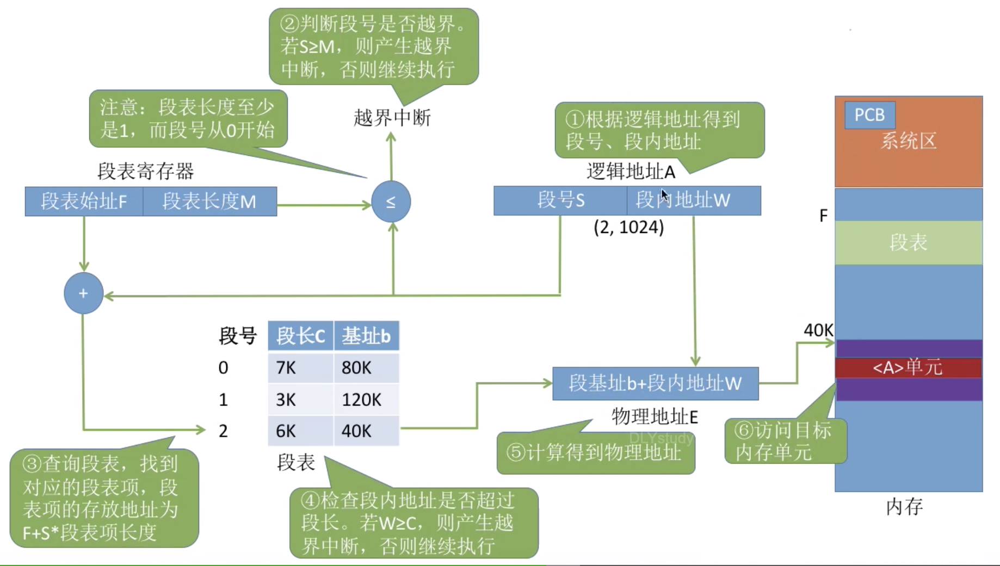

与分页管理的比较:

- 分页管理中每个页的大小是相同的
- 分段管理中每个段的大小是不同的

在分段管理中,要多一步判断,偏移地址,是否超过段长.

#### 分页与分段的对比

**页是信息的物理单位。分页的主要目的是为了实现离散分配，提高内存利用率。分页仅仅是系统管理上的需要，完全是系统行为，对用户是不可见的**。

**段是信息的逻辑单位。分段的主要目的是更好地满足用户需求。一个段通常包含着一组属于一个逻辑模块的信息。分段对用户是可见的，用户编程时需要显式地给出段名**

分段比分页更容易实现信息的共享和保护:

- 数据段
- 程序段

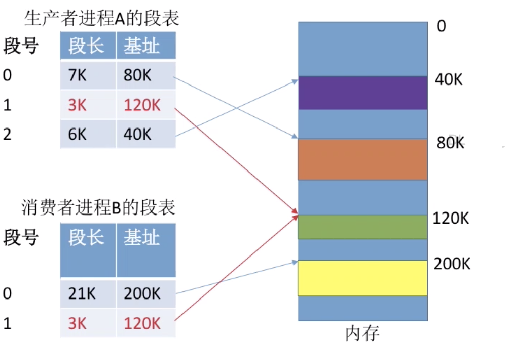

只需让各进程的段表项指向同一个段即可实现共享.


访问一个逻辑地址需要几次访存？

分页（单级页表）：第一次访存ー一査内存中的页表，第二次访存ー一访问目标内存单元。总共两次访存

分段：第一次访存ー一査内存中的段表，第二次访存ーー访问目标内存单元。总共两次访存

与分页系统类似，分段系统中也可以引入快表机构，将近期访问过的段表项放到快表中，这样可以少一次访问，加快地址变换速度。

#### 总结


### 段页式存储管理


#### 分页和分段的优缺点分析

|          | 优点                                                     | 缺点                                                         |
| -------- | -------------------------------------------------------- | ------------------------------------------------------------ |
| 分页管理 | 内存空间利用率高，不会产生外部碎片，只会有少量的页内碎片 | 不方便按照逻辑模块实现信息的共享和保护                       |
| 分段管理 | 很方便按照逻辑模块实现信息的共享和保护                   | 如果段长过大，为其分配很大的连续空间会很不方便。另外，段式管理会产生外部碎片 |


#### 段页式管理介绍

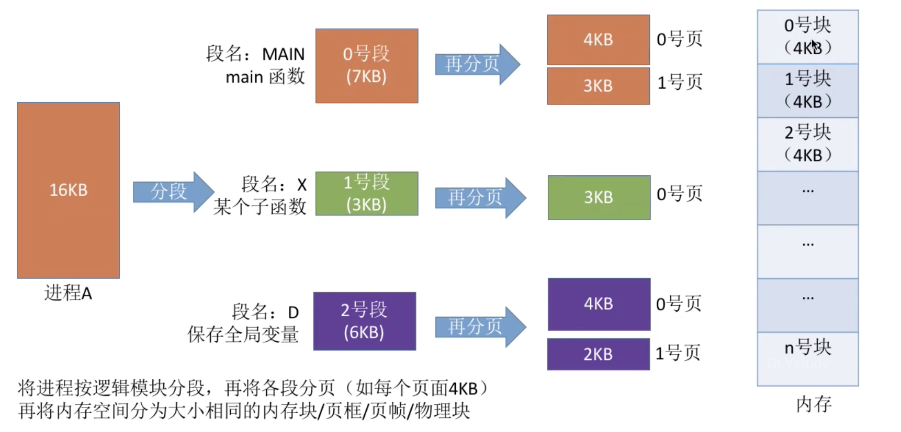

#### 逻辑地址结构


段页式系统的逻辑地址结构由段号、页号、页内地址（页内偏移量）组成。

段号的位数决定了每个进程最多可以分几个段

页号位数决定了每个段最大有多页

页页内偏移量决定了页面大小、内存块大小是多少

eg:

在上述例子中，若系统是按字节寻址的

段号占 16 位，因此在该系统中，每个进程最多有 216=64 K 个段

页号占 4 位，因此每个段最多有 24=16 页

页内偏移量占 12 位，因此每个页面每个内存块大小为 212=4096=4 KB


“分段”对用户是可见的，程序员编程时需要显式地给出段号、段内地址。

而将各段“分页”对用户是不可见的。系统会根据段内地址自动划分页号和页内偏移量。

因此段页式管珌的地址结构是2维的。


#### 段表 页表


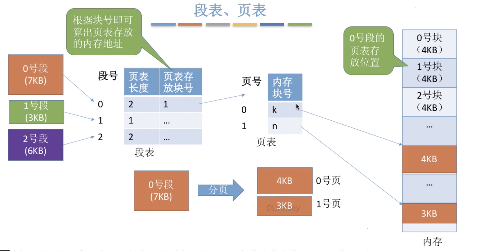

每个段对应一个段表项，每个段表项由段号、页表长度、页表存放块号（页表起始地址）组成。每个段表项长度相等，段号是隐含的。

每个页面对应一个页表项，每个页表项由页号、页面存放的内存块号组成。每个页表项长度相等，页号是隐含的

#### 地址转化


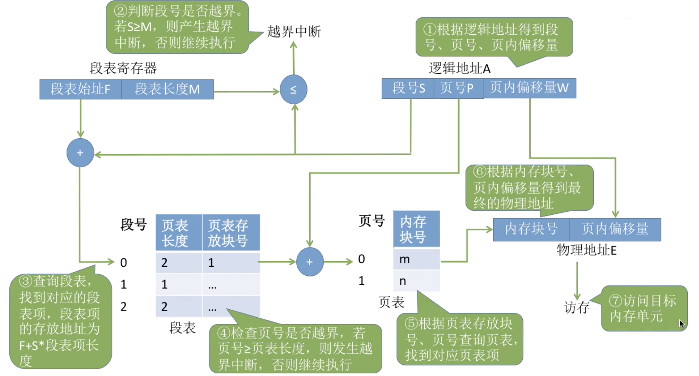

过程中需要三次访存

- 访问段表
- 访问页表
- 访问物理内存

可以引入快表,用段号和页号作为关键字,快表命中则只需一次访存.

#### 总结

