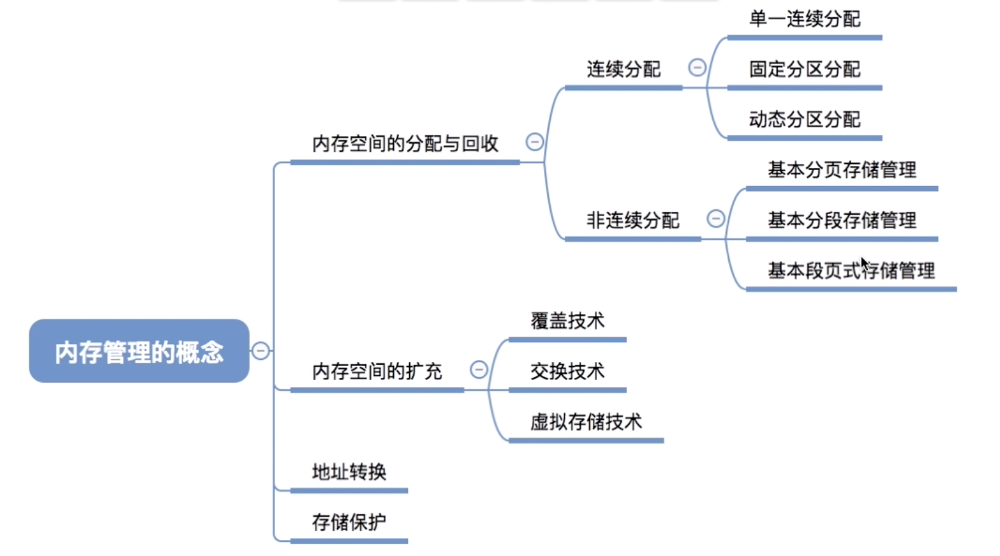

## 概述

### 虚拟内存的基本概念

#### 传统存储管理方式的优点和缺点

连续分配:

- 单一连续分配 
- 固定分区分配
- 动态分区分配

非连续分配:

- 基本分页存储管理 

- 基本分段存储管理
- 基本段页式存储管理

一次性：作业必须一次性全部装入内存后オ能开始运行。这会造成两个问题：①作业很大时，不能全部装入内存，导致大作业无法运行；②当大量作业要求达行时，由于内存无法容纳所有作业，因此只有少量作业能运行，导致多道程序并发度下降。

驻留性：一旦作业被装入内存，就会一直驻留在内存中，直至作业运行结東。事实上，在一个时间段内，只需要访问作业的一小部分数据即可正常运行，这就导致了内存中会驻留大量的、暂时用不到的数据，浪费了宝贵的内存资源。

#### 局部性原理

时间局部性：如果热行了程序中的某条指令，那么不久后这条指令很有可能再次执行；如果某个数据被访问过，不久之后该数据很可能再次被访问。（因为程序中存在大量的循环）

空间局部性：一旦程序访问了某个存储单元，在不久之后，其附近的存储单元也很有可能被访问。（因为很多数据在内存中都是连续存放的，并且程序的指令也是顺序地在内存中存放的）

#### 虚拟内存的定义和特征

基于局部性原理，在程序装入时，可以将程序中很快会用到的部分装入内存，暂时用不到的部分留在外存，就可以让程序开始执行。

在程序执行过程中，当所访问的信息不在内存时，由操作系统负责将所需信息从外存调入内存，然后继续执行程序

若内存空间不够，由操作系统负责将内存中暂时用不到的信息换出到外存

在操作系统的管理下，在用户看来似乎有一个比实际内存大得多的内存，这就是虚拟内存.

这也是操作系统虚拟性的体现

#### 虚拟内存的特性

虚拟内存有一下三个主要特征

- 多次性：无需在作业运行时一次性全部装入内存，而是允许被分成多次调入内存。
- 对换性：在作业运行时无需一直常驻内存，而是允许在作业运行过程中，将作业换入、换出。
- 虚拟性：从逻辑上扩充了内存的容量，使用户看到的内存容量，远大于实际的容量

#### 如何实现虚拟内存技术

虚拟内存技术，允许一个作业分多次调入内存。如果采用连续分配方式，会不方便实现。**因此，虚拟内存的实现需要建立在离散分配的内存管理方式基础上。**

基本分传统的非连续分配存储管理:

- 基本分页
- 基本分段
- 基本段页

虚拟内存的实现:

- 请求分页存储管理

- 请求分段存储管理

- 请求段页式存储管理

主要区别：

在程序执行过程中，当所访问的信息不在内存时，由操作系统负责将所需信息从外存调入内存，然后继续执行程序。

若内存空间不够，由操作系统负责将内存中暂时用不到的信息换出到外存.

这也就是要增加两个功能:

- 请求调页/段
- 页面置换/段置换

#### 总结

## 请求分页的管理方式

## 页面置换算法

## 页面分配策略