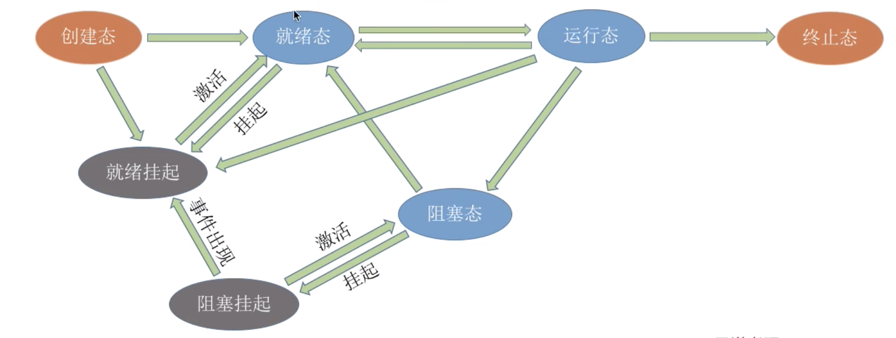
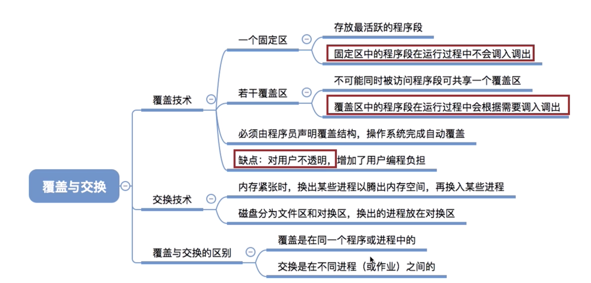

## 覆盖

### 覆盖技术(早期操作系统)

人们引入了覆盖技术，用来解决“程序大小超过物理内存总和”的问题

覆盖技术的思想：将程序分为多个段（多个模块）。

**常用的段常驻内存，不常用的段在需要时调入内存。**

内存中分为一个“固定区”和若干个“覆盖区”。

需要常驻内存的段放在“固定区”中，调入后就不再调出（除非运行结束）

不常用的段放在覆盖区”，需要用到时调入内存，用不到时调出内存

### 例子

某程序中A模块是主要模块,它可能调用B或者C,但是不会同时调用B C.

这时可以利用覆盖技术.

**按照自身逻辑结构，让那些不可能同时被访问的程序段共享同个覆盖区**

**必须由程序员声明覆盖结构，操作系统完成自动覆盖。**

**缺点：对用户不透明，增加了用户编程负担**

## 交换

### 交换技术

交换（对换）技术的设计思想：内存空间紧张时，系统将内存中某些进程暂时换出外存，把外存中某些已具备运行条件的进程换入内存（**进程在内存与磁盘间动态调度**）.

> PCB常驻内存,不然没地方记录磁盘中存储进程的位置

中级调度（内存调度），就是要决定将哪个处于挂起状态的进程重新调入内存.

交换（对换）技术的设计思想：内存空间紧张时，系统将内存中某些进程暂时换出外存，把外存中某些已具备运行条件的进程换入内存（进程在内存与磁盘间动态调度）

**暂时换出外存等待的进程状态为挂起状态（挂起态，suspend）**

挂起态又可以进一步细分为就绪挂起、阻塞挂起两种状态

回忆下进程的7状态模型

### 思考

1. #### 应该在外存（磁盘）的什么位置保存被换出的进程？

2. 什么时候应该交换？

3. 应该换出哪些进程？

#### 应该在外存（磁盘）的什么位置保存被换出的进程？

具有对换功能的操作系统中，通常把磁盘空间分为文件区和对换区两部分。

文件区主要用于存放文件，主要追求存储空间的利用率，因此对文件区空间的管理采用离散分配方式：

对换区空间(Swap)只占磁盘空间的小部分，被换出的进程数据就存放在对换区。由于对换的速度直接影响到系统的整体速度，因此对换区空间的管理主要追求换入换出速度，因此通常对换区采用连续分配方式（学过文件管理章节后即可理解)。总之,对换区的IO速度比文件区的更快。

#### 什么时候应该交换？

交换通常在许多进程运行且内存吃紧时进行，而系统负荷降低就暂停。

例如：在发现许多进程运行时经常发生缺页，就说明内存紧张，此时可以换出一些进程如果缺页率明显下降，就可以暂停换出。

#### 应该换出哪些进程？

可优先换出阻塞进程；可换出优先级低的进程；为了防止优先级低的进程在被调入内存后很快又被换出，有的系统还会考虑进程在内存的驻留时间. 

注意PCB常驻内存,不会被换出.

## 总结

## 虚拟存储技术

其他章节展开

