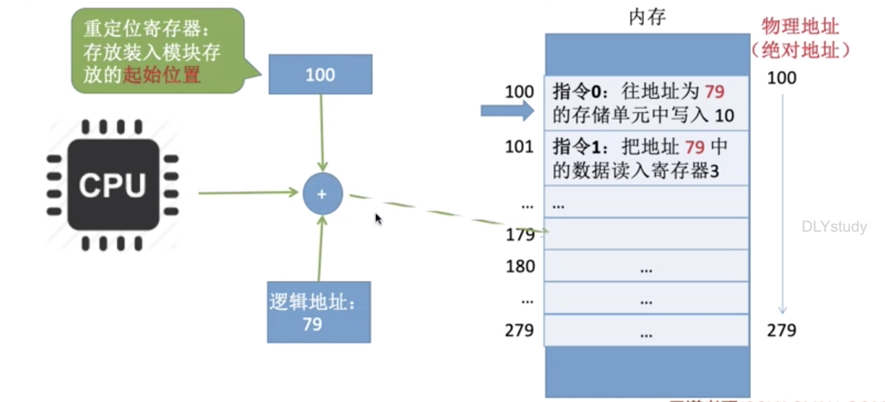
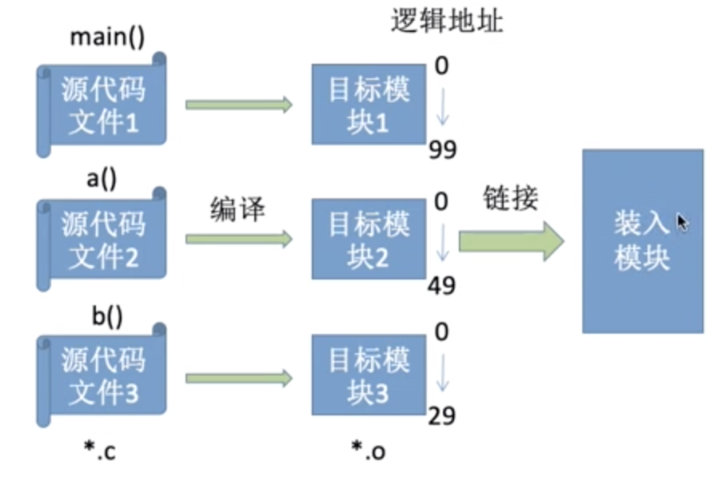
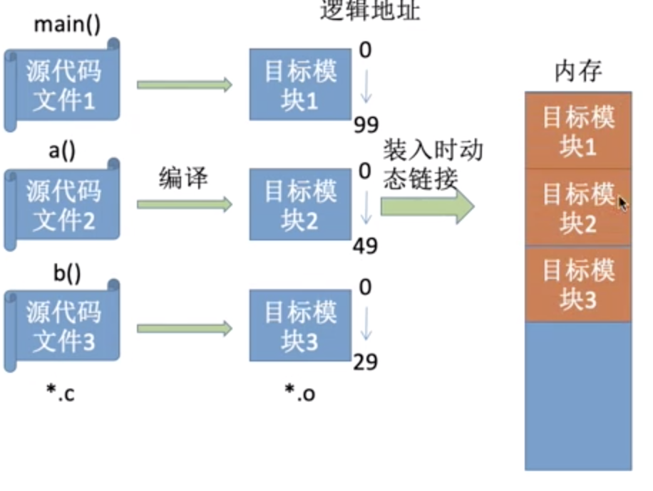
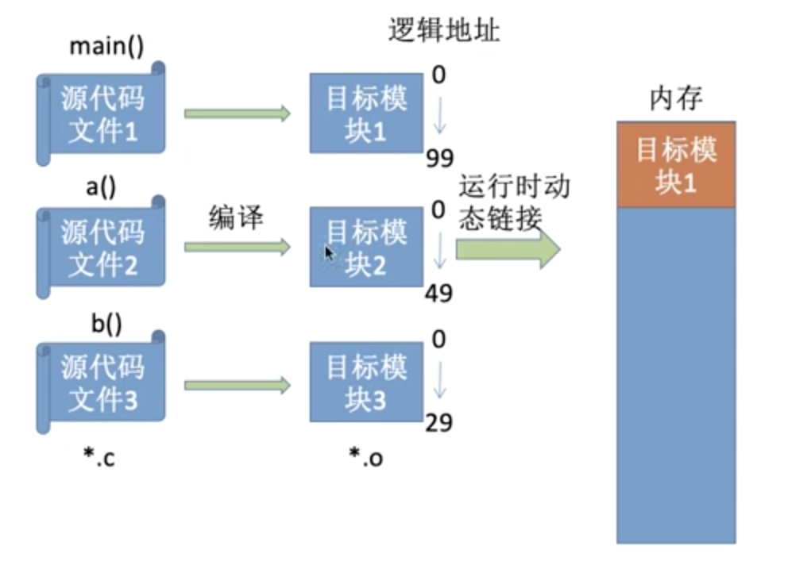

## 什么是内存

存放数据 

CPU -- 内存 -- 硬盘

将所有空间按单元编址.

> 2^10 = 1K
>
> 2^20 = 1M
>
> 2^30 = 1G

## 逻辑地址与物理地址

程序经过编译、链接后生成的指令中指明的是逻辑地址（相对地址），即:相对于进程的起始地址而言的地址

物理地址是绝对地址

### 逻辑地址与物理地址的转换

#### 绝对装入

在编译时，**如果知道程序将放到内存中的哪个位置**，编译程序将产生绝对地址的目标代码**。装入程序按照装入模块中的地址，将程序和数据装入内存。

Eg：如果知道装入模块要从地址为 100 的地方开始存放

绝对装入只适用于单道程序环境

#### 静态重定位

又称可重定位装入。编译、链接后的装入模块的地址都是从0开始的，**指令中使用的地址、数据存放的地址都是相对于起始地址而言的逻辑地址**。

**可根据内存的当前情况，将装入模块装入到内存的适当位置。装入时对地址进行“重定位”，将逻辑地址变换为物理地址(地址变换是在装入时一次完成的)。**

装入的起始物理地址为 100, 则所有地址相关的参数都+100

静态重定位的特点是在一个作业装入内存时，**必须分配其要求的全部内存空间**，如果没有足够的内存，就不能装入该作业。

作业一且进入内存后，在运行期间就不能再移动，也不能再申请内存空间。

#### 动态重定位(现代)

又称动态运行时装入。编译、链接后的装入模块的地址都是从 0 开始的。**装入程序把装入模块装入内存后，并不会立即把逻辑地址转换为物理地址，而是把地址转换推迟到程序真正要执行时オ进行**。

因此装入内存后所有的地址依然是逻辑地址。这种方式需要一个**重定位寄存器**的支持。

采用动态重定位时允许程序在内存中发生移动。

并且可将程序分配到不连续的存储区中；在程序运行前只需装入它的部分代码即可投入运行，然后在程序运行期间，根据需要动态申请分配内存；

便于程序段的共享，可以向用户提供一个比存储空间大得多的地址空间。

##  链接的三种方式

### 静态链接

在程序运行之前先将备目标模块及它们所需的库函数连接成一个完整的可执行文件（装入模块）之后不再拆开。

### 装入时动态链接

将各目标模块装入内存时，边装入边链接的链接方式。

### 运行时动态链接

在程序执行中需要该目标模块时，才对它进行链接。其优点是便于修改和更新，便于实现对目标模块的共享。

需要什么装入什么

## 总结

