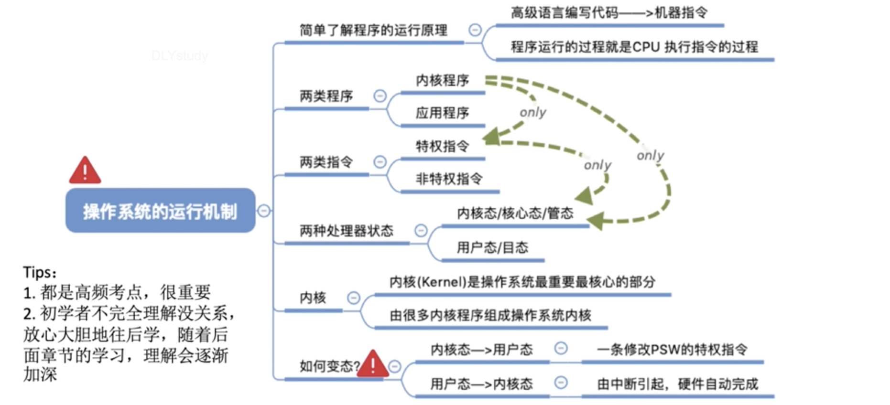

## 操作系统的运行环境

| 核心态      用户态   |      |
| :------------------- | ---- |
| 内核程序  应用程序   |      |
| 特权指令  非特权指令 |      |

- CPU从内核态切换到用户态是由更改PSW状态字的特权指令实现的，意味着操作系统主动让出CPU使用权。

- CPU从用户态到内核态是由中断引发，硬件自动完成，触发中断信号意味着操作系统强行夺回CPU的使用权。

**FAQ**

PSW ：程序状态寄存器

Alias：

内核态=核心态=管态

用户态=目态

除了非法使用特权指令外，还有很多因素会引发中断。而共性是：这时候需要操作系统介入。

#### 总结

docker只需要linux的内核就够了