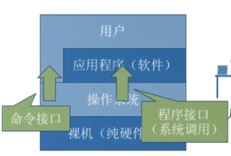
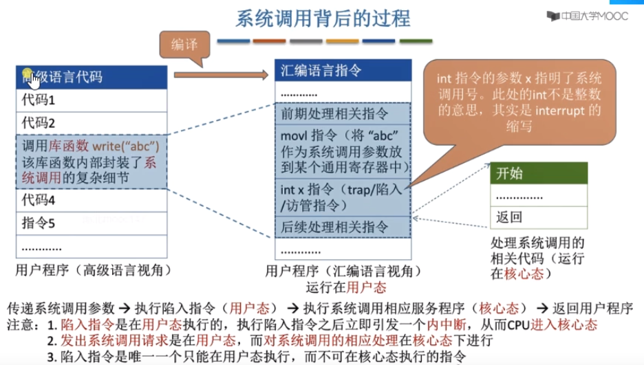
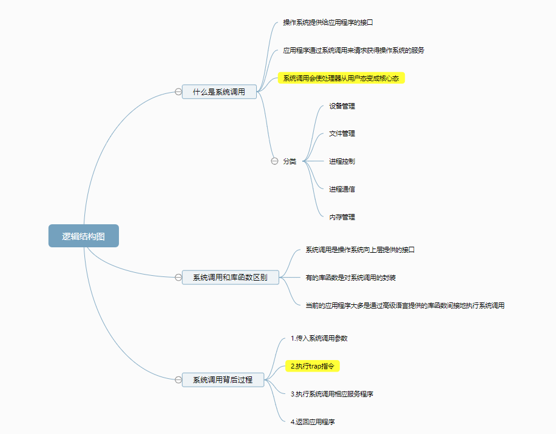

### 系统调用

> 操作系统作为用户和计算机硬件之间的接口，向上层提供命令接口和程序接口，其中，程序接口由一组系统调用组成。

- 命令接口 （允许用户直接使用）
  - 联机：用户说一句，系统做一句
  - 脱机：用户说一堆，系统做一堆  ？？？
- 程序接口（允许用户通过程序简介调用）一组系统调用

各项资源（存储、IO、文件管理）由操作系统进行控制和协调，保证系统的稳定性和安全性。

用户通过系统调用请求。

> 许多高级语言的库函数是对系统调用的封装，当然有的库函数不涉及系统调用。

陷入指令（trap、访管指令）是唯一一个只能在用户态执行的指令。

陷入指令在用户态发出、之后立即引发内中断，CPU进入核心态。

总结

