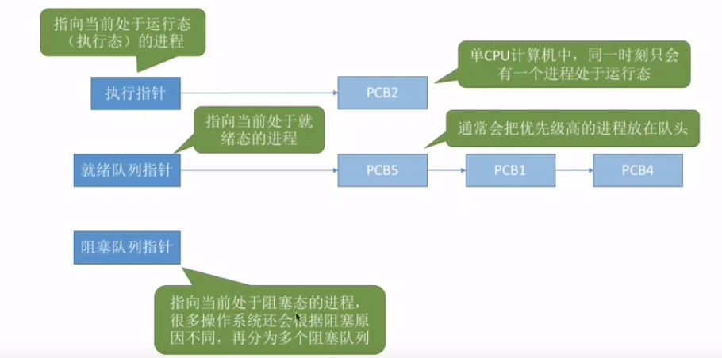

### 进程

> 操作系统进行资源分配和“调度”的独立单位

进程是进程实体动态的运行过程，如果非要细分的话

进程实体 

- **PCB** （进程管理信息）

  系统为每个运行的程序配置一个数据结构，称之为进程控制块PCB，用来描述进程的各种信息(如程序代码存放位置)

  其实创建进程就是创建进程实体的PCB，同理撤销

  **PCB是进程存在的唯一标志**

  

​       PID：进程被创建时，操作系统会分配唯一ID

​       寄存器值：上下文

- 程序段 （程序本身运行所需）

  程序代码

- 数据段（程序本身运行所需）

  全局变量，局部变量，宏定义的常量

**进程数据块 和 Java虚拟机堆 栈？** 

**待总结**

##### 进程的组织

> 成百上千个PCB如何组织

链接方式

​      按进程状态分队列，操作系统持有不同指针

索引方式

​      根据进程状态分索引表

链接方式

索引方式

总结

