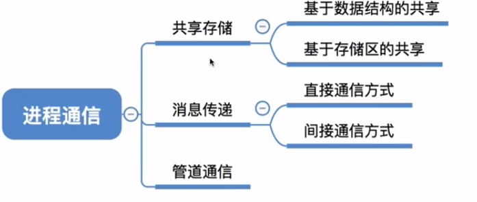
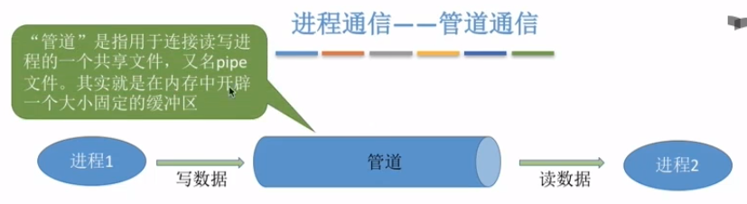
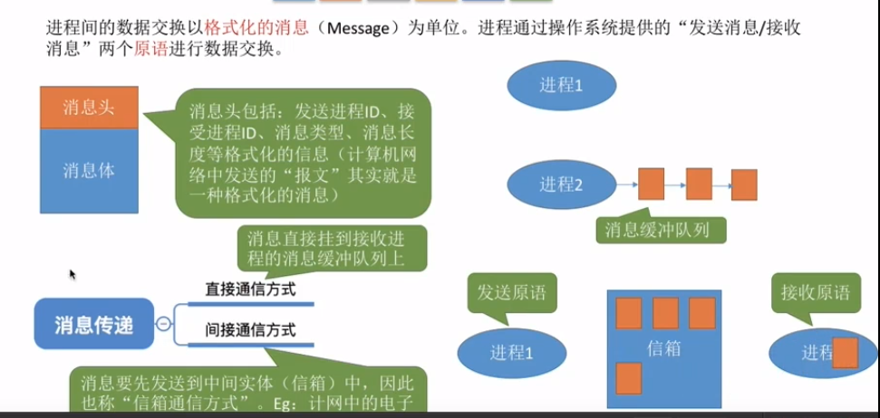

### 进程通信

> 进程信息交换

- 共享存储

- 管道

- 消息传递
  

##### 共享空间

多个进程互斥的访问共享空间

基于数据结构的共享

基于存储区的共享，数据的形式和存放位置都由进程控制

##### 管道

各进程互斥的访问管道

一个管道只能实现半双工的通信，全双工需要两个管道

数据以字符流的形式写入管道，当管道写满了，写进程的write（）会被阻塞，等待被读取

反之一样，读进程的read（）会被阻塞。

写满才能读，读空才能写

##### 消息传递

进程间的数据交换以格式化的消息为单位。进程通过操作系统提供的发送消息/接受消息两个原语来进行数据交换。

总结

