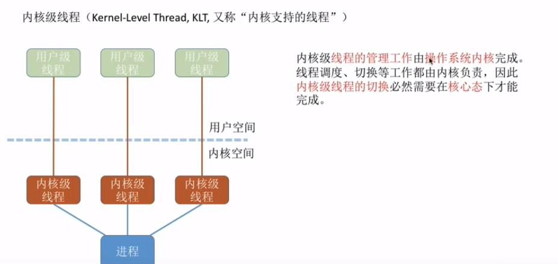
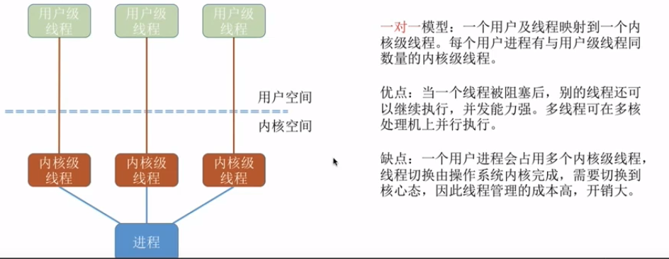
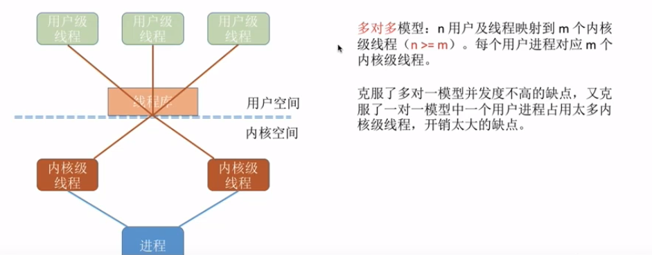
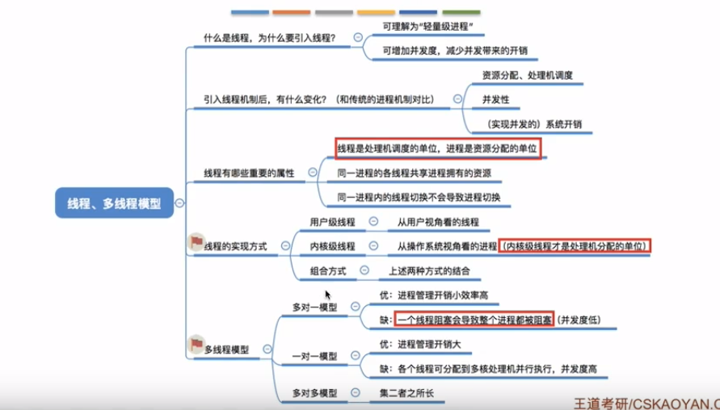

### 线程

> 有的进程需要同时处理很多事情，比如qq，而传统的进程只能串行的执行一系列服务。为此，引入了“线程”，来增加并发度。
> 

引入了线程后，线程成了程序执行流的最小单位，也就是基本的CPU执行单元。

线程之间也可以并发执行，这样并发度提升了，比如一个qq，同时聊天、传文件。

注意，引入线程后，进程只作为除CPU之外的系统资源的分配单元，如打印机、内存。

##### 带来的变化

##### 线程

- 线程是处理机调度的单位
- 多cpu计算机中，各个线程可以占用不同cpu
- 每个线程都有自己的线程id，线程控制块（TCB）
- 线程的基本状态同进程
- 线程的资源来自于进程，同一进程下资源共享
- 由于共享内存地址空间，同一进程下的线程通信，甚至不需要操作系统参与
- 同一个进程中的线程切换，不会引起进程切换。
- 不同进程的线程切换，会引起进程切换
- 同进程的线程，切换开销不大

#### 线程的实现方式

用户级线程

内核级线程KLT（实际被cpu调度）

有的操作系统同时支持用户级线程和内核级线程，采用二者组合的方式，将n个用户级线程映射到m个内核级线程上（n>=m)

**只有内核级线程才会被操作系统看到，因此只有内核级线程才是处理机分配的单位**

#### 多线程模型

>  在同时支持用户级线程和内核级线程的操作系统中，由几个用户级线程映射到内核级线程的问题。

- 多对一模型

- 一对一模型

 

- n-m多对多模型

总结

.

.