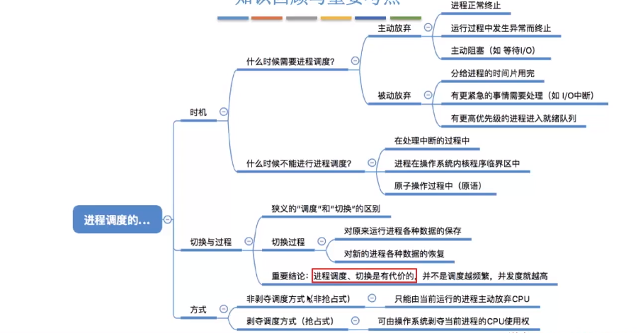

## 进程调度的时机

进程调度就是按照某种算法从就绪队列中选择一个进程为其分配处理机。

### 进程调度的时机（低级调度）

进程主动放弃：

- 进程正常终止
- 异常终止
- 进程主动阻塞（请求IO）

进程被动放弃：

- 时间片用完
- 有更紧急的事情处理（比如IO中断）
- 被更高优先级的进程抢占

**不能进行调度**的情况:

1. 在处理**中断**的过程中。中断处理过程复杂，与硬件密切相关，很难
   做到在中断处理过程中进行进程切换。
2. 进程在**操作系统内核程序临界区**中
3. 在**原子操作过程中（原语）**。原子操作不可中断，要一气呵成（如之前讲过的修改PCB中进程状态标志，并把PCB放到相应队列）

> 内核程序临界区与一般临界区不同。
>
> 内核程序临界区一般是用来访问**某种内核数据结构**的，比如进程的就绪队列（由各就绪进程的PCB组成）
>
> 内核程序临界区访问的临界资源如果不尽快释放的话，极有可能影响到操作系统内核的其他管理
> 工作。因此在访问内核程序临界区期间不能进行调度与切换。
>
> 普通的临界区比如打印机。
>
> 普通临界区访问的临界资源不会直接影响操作系统内核的管
> 理工作。因此在访问普通临界区时可以进行调度与切换。

## 进程调度的方式

### 非抢占

非剥夺调度方式，又称非抢占方式。**即只允许进程主动放弃处理机**。在运行过程中即便有更紧迫
的任务到达，当前进程依然会继续使用处理机，直到该进程终止或主动要求进入阻塞态。
只适用于早起批处理系统，无法处理紧急任务。

### 抢占

剥夺调度方式，又称抢占方式。当一个进程正在处理机上执行时，如果有一个更重要或更紧迫的进
程需要使用处理机，则立即暂停正在执行的进程，将处理机分配给更重要紧迫的那个进程。

**可以优先处理更紧急的进程，也可实现让各进程按时间片轮流执行功能（通过时钟中断）。适合于分时操作、实时操作系统**

## 进程的切换与过程

“狭义的进程调度”与“进程切换”的区别：
狭义的进程调度指的是从就绪队列中选中一个要运行的进程。（这个进程可以是刚刚被暂停执行的进程，
也可能是另一个进程，后一种情况就需要进程切换）
进程切换是指一个进程让出处理机，由另一个进程占用处理机的过程。

**广义的进程调度包含了选择一个进程和进程切换两个步骤**。

进程切换的过程主要完成了：
1.对原来运行进程各种数据的保存
2.对新的进程各种数据的恢复（如：程序计数器、程序状态字、各种数据寄存器等处理机现场信息，这些信息一般保存在进程控制块）

注意：进程切换是有代价的，因此如果过于频繁的进行进程调度、切换，必然会使整个系统的效率降低，
使系统大部分时间都花在了进程切换上，而真正用于执行进程的时间减少。

## 总结

