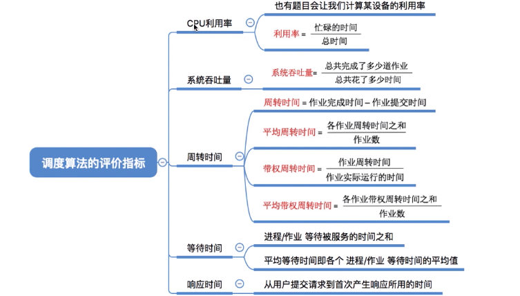

## 调度算法的评价指标

- CPU利用率

  忙碌的时间/总时间

- 系统吞吐量

  操作系统希望最少的时间处理完最多的任务

  系统吞吐量：单位时间完成的作业数量

  系统吞吐量=总共完成了多少作业/总共花费的时间

- 周转时间

  从作业被提交给系统开始，到作业被完成所花费的时间。 

  它包括四个部分：作业在外存后备队列上等待作业调度（高级调度）的时间、进程在就绪队列上等
  待进程调度（低级调度）的时间、进程在CPU上执行的时间、进程等待I/O操作完成的时间。后三项
  在一个作业的整个处理过程中，可能发生多次。

  周转时间= 作业完成时间- 作业提交时间

  平均周转时间：各作业周转时间之和/作业数。

  带权周转时间= 作业周转时间/作业实际运行时间。  必然大于1.带权周转时间更小，用户满意度更高。

​        平均带权周转时间=各作业带权周转时间之和/作业数。

- 等待时间

  等待时间，指进程/作业处于等待处理机状态时间之和，等待时间越长，用户满意度越低。

  对于进程来说，**等待时间就是指进程建立后等待被服务的时间之和，在等待I/O完成的期间其实进程也是在被服务的，所以不计入等待时间。**
对于作业来说，不仅要考虑建立进程后的等待时间，还要加上作业在外存后备队列中等待的时间。
一个作业总共需要被CPU服务多久，被I/O设备服务多久一般是确定不变的，因此调度算法其实只会
影响作业／进程的等待时间。当然，与前面指标类似，也有“平均等待时间”来评价整体性能。

- 响应时间

  从用户提交请求，到首次被系统响应的时间。

## 总结

