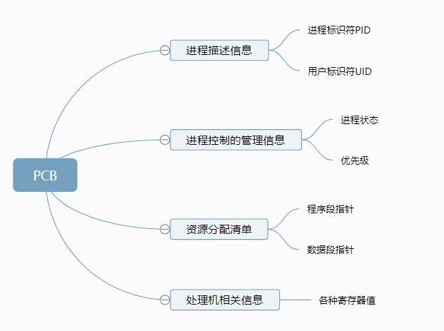
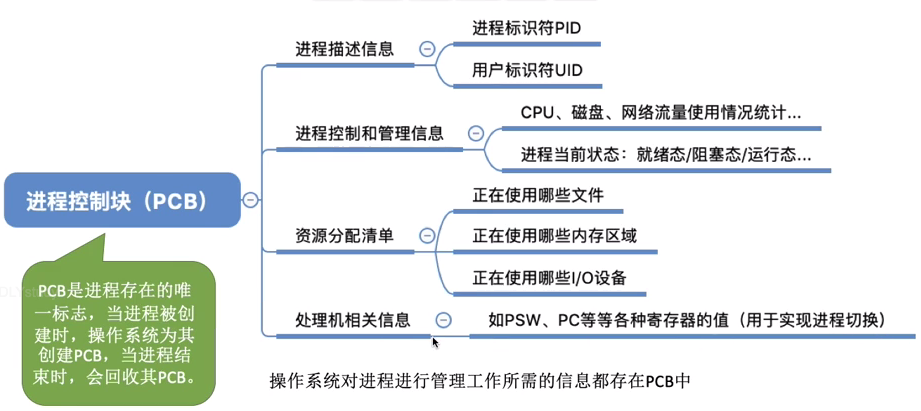
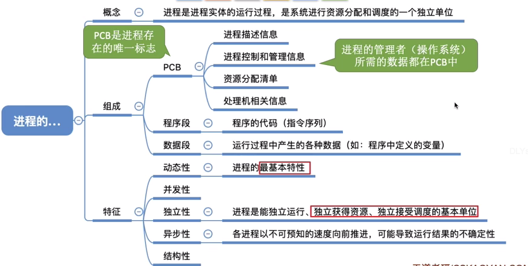

## 进程

> 操作系统进行资源分配和“调度”的独立单位

进程是进程实体动态的运行过程，如果非要细分的话

#### 进程实体 

- **PCB** （进程管理信息）

  系统为每个运行的程序配置一个数据结构，称之为进程控制块PCB，用来描述进程的各种信息(如程序代码存放位置)

  其实创建进程就是创建进程实体的PCB，同理撤销

  **PCB是进程存在的唯一标志**

  

      

 PID：进程被创建时，操作系统会分配唯一ID

​       寄存器值：上下文

- 程序段 （程序本身运行所需）

  程序代码

- 数据段（程序本身运行所需）

  全局变量，局部变量，宏定义的常量

#### 进程的特征

- 动态性 进程是程序执行的一次过程，是动态的产生、变化和消亡的，一个qq程序可以运行多次，产生多个进程。
- 并发性 内存中有多个进程实体，各进程可并发执行
- 独立性 进程是能独立运行、独立获得资源、独立接受调度的基本单位
- 异步性 各进程按照各自独立的、不可预知的速度向前推进，操作系统要提供"进程同步机制"来解决异步问题
- 结构性 每个进程都有自己的PCB。从结构上看，进程由程序段、数据段、PCB组成。

**进程数据块 和 Java虚拟机堆 栈？** 

#### 总结

