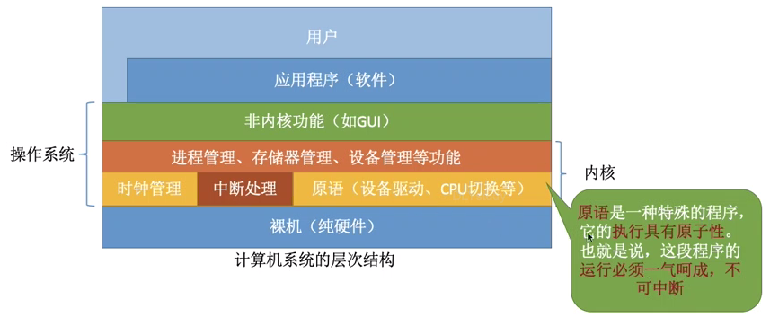
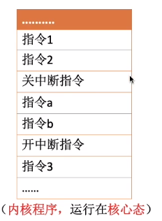
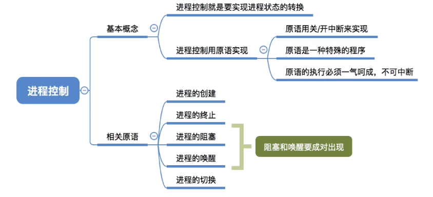

## 进程控制

>  创建、撤销、状态切换,底层使用原语实现

### 原语

- 使用开、关中断实现原子操作(如果没有原子性可能导致操作系统关键数据结构信息不一致的错误，比如state标示为就绪，但在阻塞队列)

- 一种特殊程序，运行在核心态

- 原语的执行必须一气呵成

原语使用开、关中断的**特权**指令实现原子性，使用了关中断指令后，不再响应中断。

### 进程原语

#### 创建原语

1. 申请空白PCB
2. 为新进程分配所需资源
3. 初始化PCB
4. 将PCB插入就绪队列（创建态 -> 就绪态）。

#### 撤销原语

1. 从PCB集合中找到终止进程的PCB
2. 若进程正在运行，立即剥夺CPU，将CPU分配给其他进程
3. 终止其所有子进程
4. 将该进程拥有的所有资源归还给父进程或操作系统
5. 删除PCB

> 引起进程终止的事件.正常结束（exit系统调用），异常结束，外部干预（信号量）

#### 阻塞原语

运行态-> 阻塞态

1. 找到要距塞的进程对应的PCB

2. 保护进程运行现场，将PCB状态倌息设置为“阻塞态”，暂时停止进程运行

3. 将PCB插入相应事件的等待队列

   时机：需要等待系统分配某种资源，需要等待相互合作其他进程完成工作

#### 唤醒原语

阻塞态 -> 就绪态

1. 在事件等待队列中找到PCB
2. 将PCB从等待队列删除，设置进程为就堵态
3. 将PCB插入就堵队列，等待被调度
   时机：等待的事件发生

#### 切换原语

1. 将运行环境信息存入PCB

2. PCB移入相应队列

3. 选择另一个进程执行，并更新其PCB

4. 根据PCB恢复新进程所需的运行环境

   时机：

   - 当前进程时间片到
   - 有更高优先级的进程到达
   - 当前进程主动阻塞
   - 当前进程终止

> 寄存器：
>
> PSW：程序状态字寄存器
> PC：程序计数器，存放下一条指令的地址
> IR指令寄存器：存放当前正在执行的指令
> 通用寄存器：其他一些必要信息

#### 总结

进程原语的工作主要分为 ：  

- 更改PCB（保存、恢复上下文、更改状态标识）
  - 所有的进程控制原语一定会更改进程状态标识
  - 剥夺当前运行进程的CPU使用权必然需要保存运行环境
  - 某进程开始运行前必然要恢复其运行环境
- 放到合适的队列
- 分配或撤销资源

