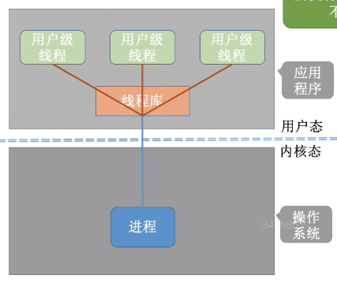
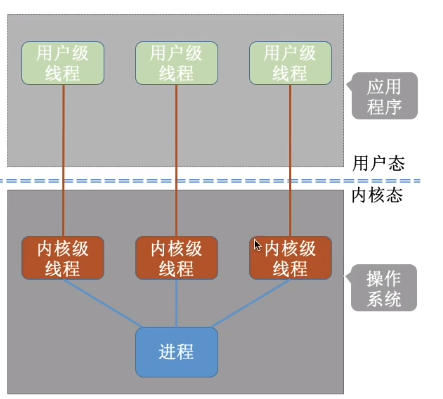
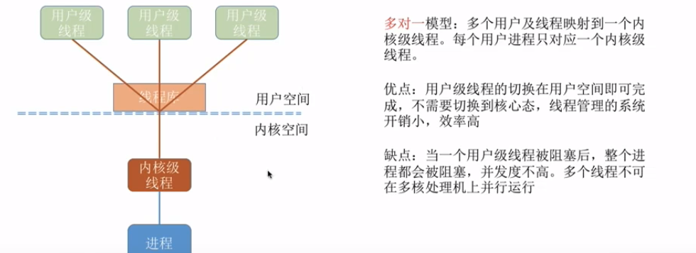
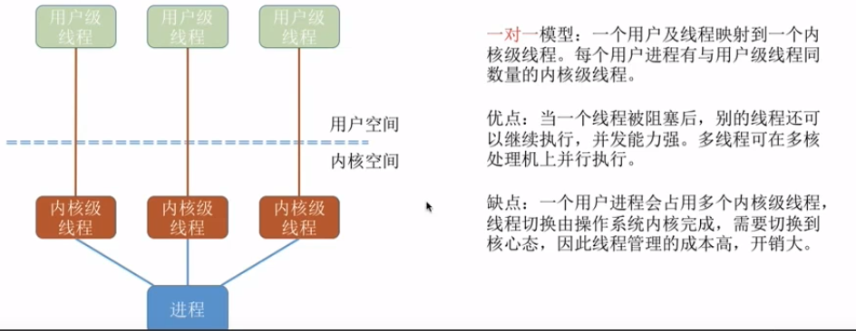
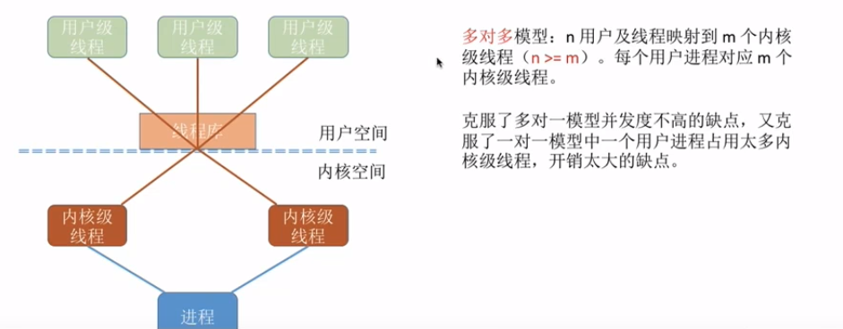
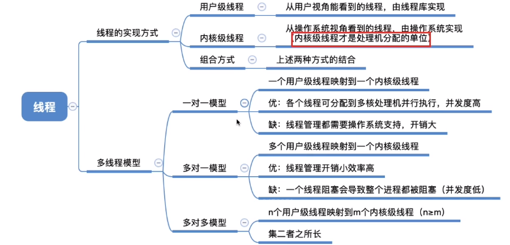

## 线程

> 有的进程需要同时处理很多事情，比如qq，而传统的进程只能串行的执行一系列服务。为此，引入了“线程”，来增加并发度。
> 

引入了线程后，线程成了程序执行流的最小单位，也就是基本的CPU执行单元。

线程之间也可以并发执行，这样并发度提升了，比如一个qq，同时聊天、传文件。

注意，引入线程后，进程只作为除CPU之外的系统资源的分配单元，如打印机、内存。

引入线程前，进程既是资源分配的基本单位，也是调度的基本单位。
引入线程后，**进程是资源分配的基本单位，线程是调度的基本单位。**

##### 带来的变化

- 资源分配，调度

  传统进程机制中,资源分配,调度的基本单位
  引入线程后，进程是资源分配的基本单位，线程是调度的基本单位

- 并发性

  传统进程机制中，只能进程间并发
  引入线程后，各线程间也能抖发，提升了并发度

- 系统开销

  传统的进程间并发，需要切换进程的运行环境，系统开销很大
  线程间并发，如果是同一进程内的线程切换，则不需要切换进程环境，系统开销小

##### 线程

- **线程是处理机调度的单位**
- 多cpu计算机中，**各个线程可以占用不同cpu**
- 每个线程都有自己的线程id，线程控制块（TCB）
- 线程的基本状态同进程
- 线程的资源来自于进程，同一进程下资源共享
- 由于共享内存地址空间，同一进程下的线程通信，甚至不需要操作系统参与
- 同一个进程中的线程切换，不会引起进程切换。
- 不同进程的线程切换，会引起进程切换
- **同进程的线程，切换开销不大**

## 线程的实现方式

### 用户级线程（User Level Thread）

用户级线程由应用程序通过线程库实现．所有的线程管理工作都由应用程序负责（包括线程切换）
用户级线程中，线程切换可以在用户态下即可完成，无需操作系统干预。
在用户看来，是有多个线程，但是在操作系统内核看来，并意识不到线程的存在。（用户级线程对用户不透明，对操作系统透明）
可以这样理解，“用户级线程”就是“从用户视角看能看到的线程"。

**优点：**用户级线程的切换在用户空间即可完成，不需要切换到核心态，线程管理的系统开销小，效率高

**缺点：**

当一个用户级线程被阻塞后，整个进程都会被阻塞，并发度不高。多个线程不可在多核处理机上并行运行。

### 内核级线程KLT(Kernel-Level Thread,KLT)

由操作系统支持的线程

有的操作系统同时支持用户级线程和内核级线程，采用二者组合的方式，将n个用户级线程映射到m个内核级线程上（n>=m)

**只有内核级线程才会被操作系统看到，因此只有内核级线程才是处理机分配的单位**

1.内核级线程的管理工作由操作系统内核完成。
2．线程调度、切换等工作都由内核负责，因此内核级线程的切换必然需要在核心态下才能完成。
3．操作系统会为每个内核级线程建立相应的TCB(Thread Control Block，线程控制块）通过TCB对线程进行管理。“内核级线程”就是“从操作系统内核视角看能看到的线程”

**优点：**当一个线程被阻塞后，别的线程还可以继续执行，并发能力强。多线程可在多核处理机上并行执行。

**缺点：**一个用户进程会占用多个内核级线程，线程切换由操作系统内核完成，需要切换到核心态，因此线程管理的成本高，开销大。

### 多线程模型

>  在同时支持用户级线程和内核级线程的操作系统中，由几个用户级线程映射到内核级线程的问题。

  

- 多对一模型

- 一对一模型

 

- n-m多对多模型

可以这么理解：
用户级线程是“代码逻辑”的载体
内核级线程是“运行机会”的载体
例如：多核cpu环境下，上面的这个进程最多能被分配两个核。

总结

.

.